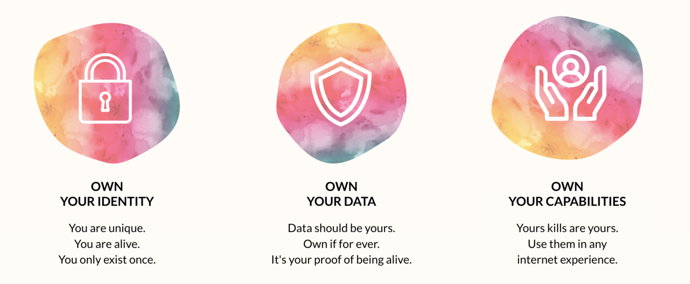

# Internet Sovereignity

  

In the current internet system I exist many times, each application provider owns my data and provides functionality they own and let me use in return for my data.

We are digitally sovereign:

- I am me, I am sovereign
- I have an identity, I only exist once
- What I learn and experience is mine 
- I do not exist for the benefit of others 
- I have my own digital skills and capabilities, these are owned by me
- Everything I produce is owned by me, and stored by my twin on locations my twin and me know about.
- Because the capabilities are owned by me, they can easily be extended and I can use them everywhere, it makes my life easier, I don't have to learn different tools each time I enter another event
- I am capable of making my own decisions

