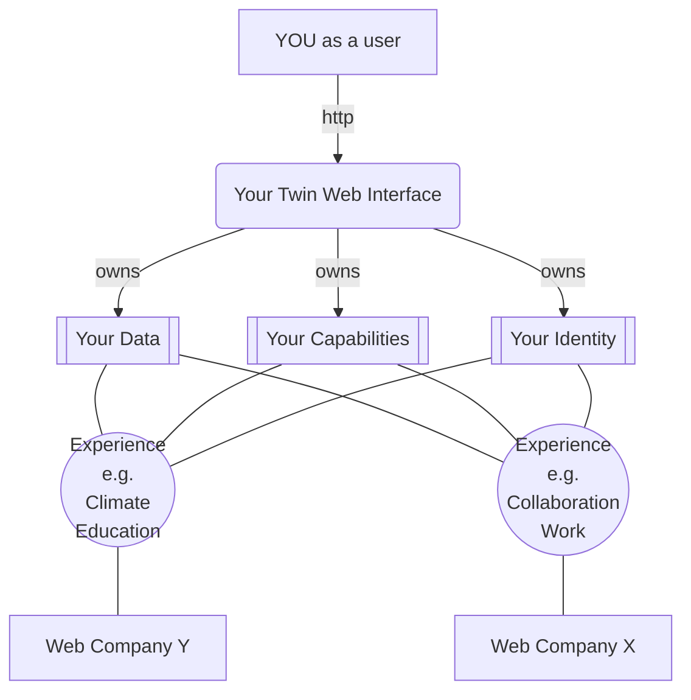
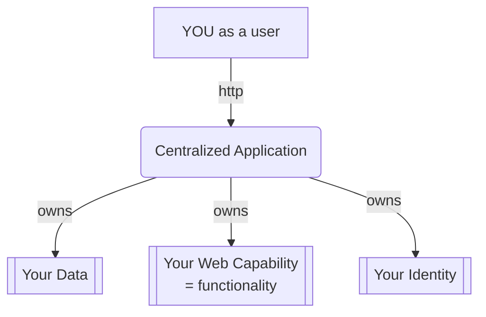
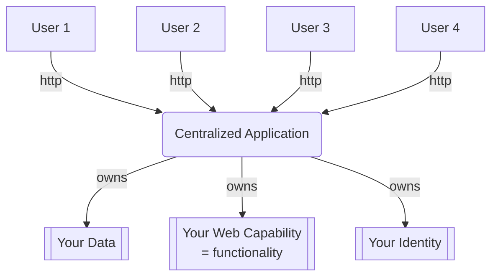
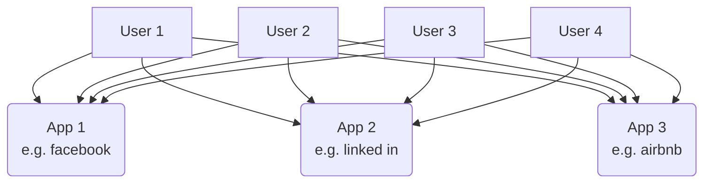
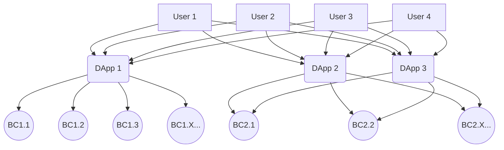
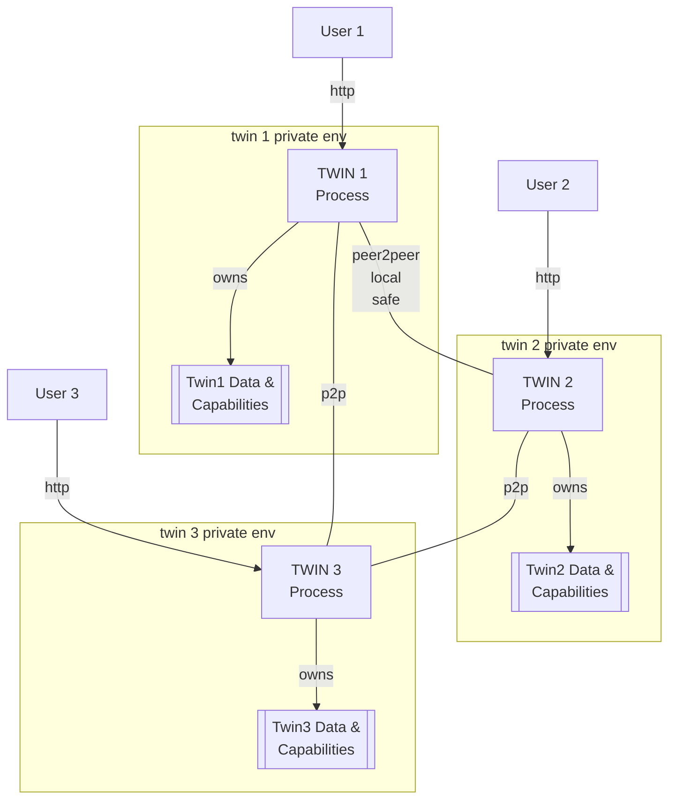

# Twin Architecture

you are sovereign, you can use any web browser to access the capabilities of your twin.

You have many [skills](myskills.md) and can use them to experience your digital life. The web-providers become experience creators in which you can be alive and experiment with your skills.

> Web Companies (or anyone who wants to develop experiences) is working with you to let you use your skills inside their experience, using your tools, data and identity. You truly exist only once and own your digital past and future.

## To Compare: how do I work in the current Web (Web 2)?

The application provider owns your experience, the experience is the combination of your data on which they develop functionality strictly controlled by their server infrastructure.

We all exist many times, for each application we exist, it actually is very messy and leads to manipulation and also complexity. Its not convenient having to use 3 different messaging apps. The current providers don't care about your sovereignity or improving your skills, they care about what they can get from you (money, data..).

This is not logical, efficient and for sure not in your best interest.

### To Compare: Blockchain: web 3

Definately a good step in the right direction but not enough.

BC stands for BlockChain, so BC1.1 is Blockchain 1 Validator Node 1.

Each DAPP lives on many blockchain nodes, can be thousands. Many dapps live on different blockchain nodes, sometimes on the same. You still exist many times and each Dapp is developed using different technologies and duplicating your digital life which you don't own but now share with others and co-own.

## Twin Communication (web4 base architecture)

This is a very different design, the experience is using your capabilities, but these are yours, not owned nor provided by the web company.

