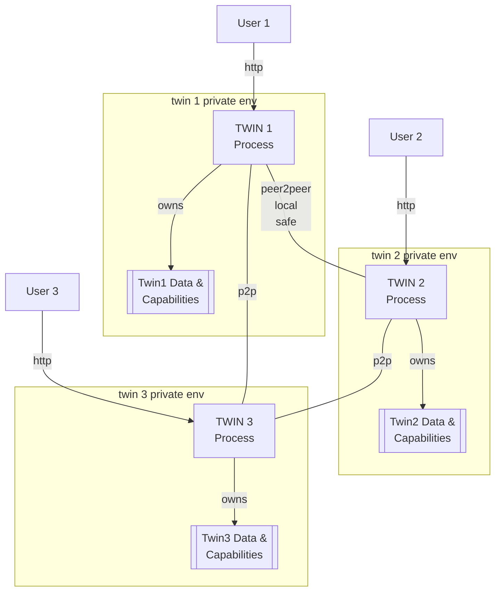

## Twin Communication

For a web4 based architecture:

```mermaid
graph TD
    A---|peer2peer<br>local<br>safe|B
    B---|p2p|C
    C---|p2p|A

    U1[User 1] -->|http| A(Your Twin Web Interface)
    U2[User 2] -->|http| B(Your Twin Web Interface)
    U3[User 3] -->|http| C(Your Twin Web Interface)
    subgraph TWIN1[twin 1 private env]
        A[TWIN 1<br>Process]
        A -->|owns| X[[Twin1 Data &<br>Capabilities]]
    end
    subgraph TWIN2[twin 2 private env]
        B[TWIN 2<br>Process]
        B -->|owns| Y[[Twin2 Data &<br>Capabilities]]
    end
    subgraph TWIN3[twin 3 private env]
        C[TWIN 3<br>Process]
        C -->|owns| Z[[Twin3 Data &<br>Capabilities]]
    end

```