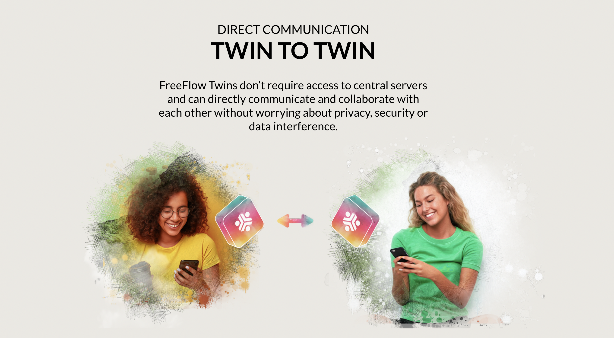

# Communicate

  

The Twin is a powerful communicator.

Features right now:

- CHAT
- VIDEO CONFERENCING
- FORUM
- ...

Any communication you do is directly between you and your peer, twin to twin. You don't need any centralized service to allow you to communicate on a global level.

It is Unique as all communication fill follow the shortest path.

  

All the communication skills will eventually be available in all experiences.

{{#include roadmap_vs_experiences_include.md}}

| **ROADMAP**                                           | OurLife | OurVerse | Sikana | Floweavers | Protocol.me |
| ----------------------------------------------------- | :-----: | :------: | :----: | :--------: | :---------: |
| Chat                                                  |    Y    |    Y     |  2023  |    2023    |      Y      |
| Video Conferencing                                    |    Y    |    Y     | Q2 23  |    2023    |      Y      |
| Messaging                                             |  2023   |   2023   |  2023  |    2023    |    2023     |
| Reliable Message Bus                                  |    Y    |  Q2 23   | Q2 23  |    2023    |      Y      |
| Planetary network (encrypted end 2 end communication) |    Y    |  Q2 23   | Q2 23  |    2023    |      Y      |
|                                                       |         |          |        |            |             |
|                                                       |         |          |        |            |             |