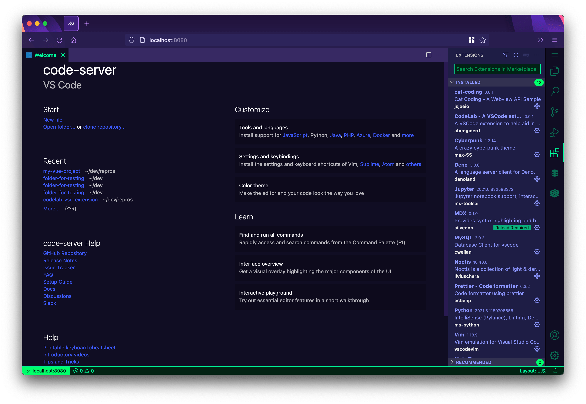
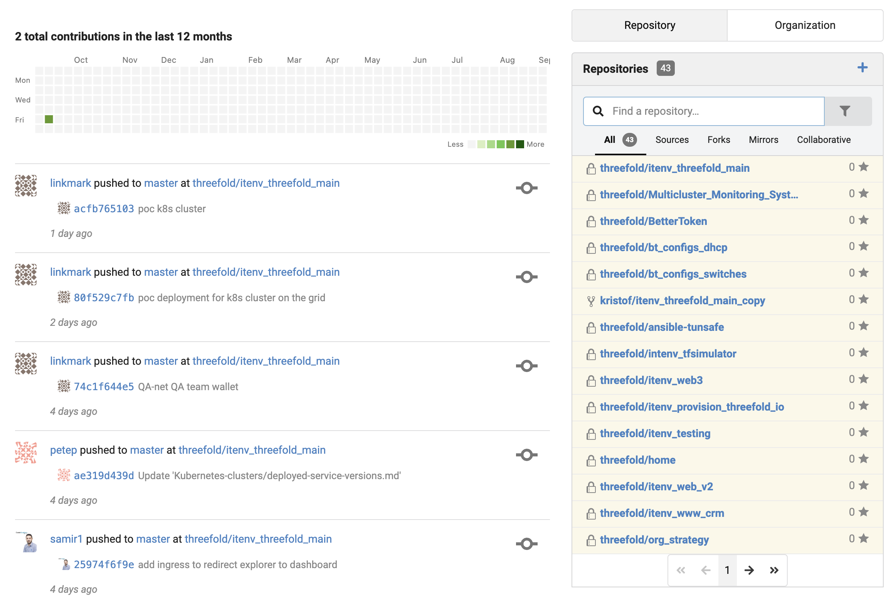

# Code

Develop directly in your private cloud, invite your friends to develop together with you.

  

Code development platform that manages your code in a git (like gitea). Your code is stored in a secure (quantum secure) environment in your own digital sovereign space.  All the regular interfaces (ssh, https and more) are available to users and to groups of users allowing you and your development group.

  

Full colaboration capabilities

  

> TODO more info

