# expand the metaverse

  

Our FreeFlow Twin is integrating with the OurVerse development platform and as such makes it easy to expand our day2day life into virtual which might be in the form of a metaverse.

## Walk Through

  

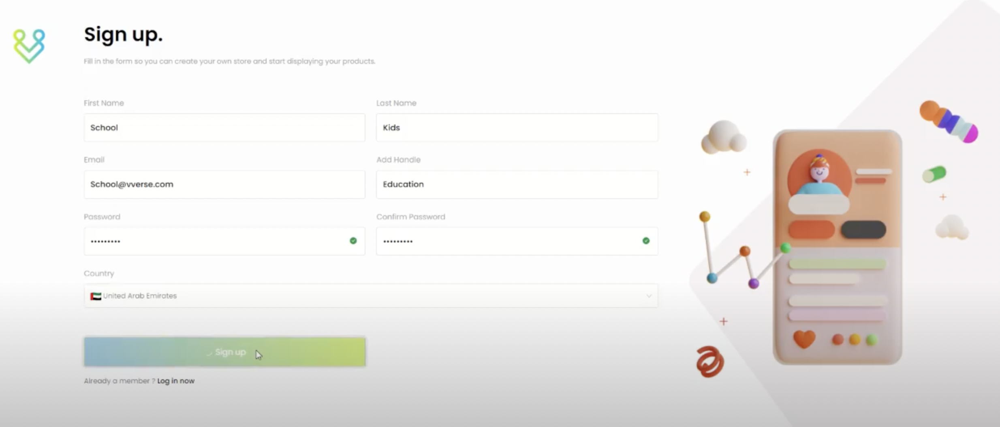  

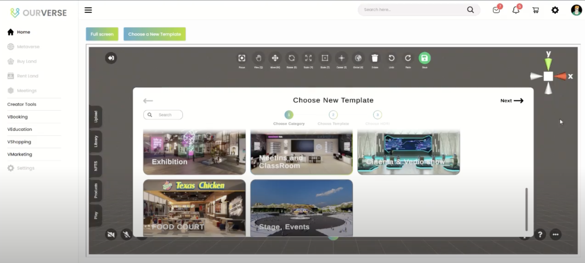  

## Education Facility

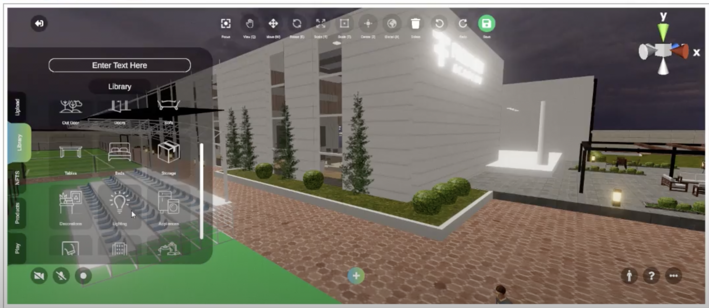  

 

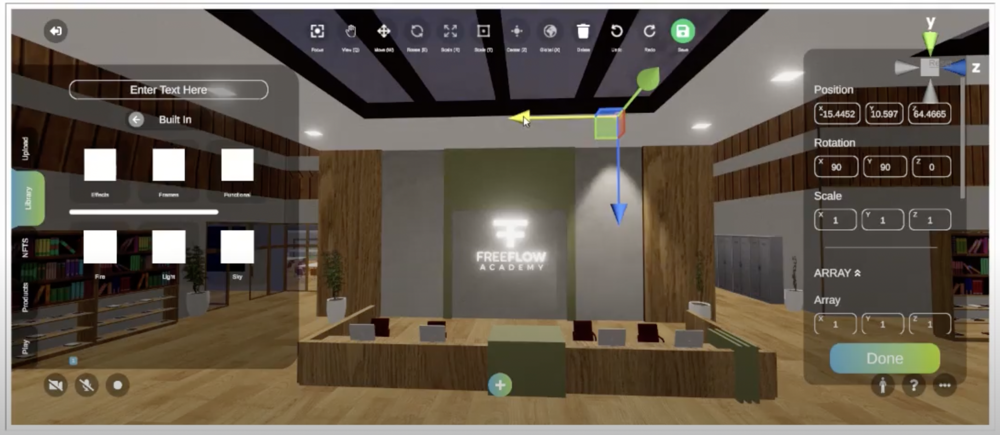  

  

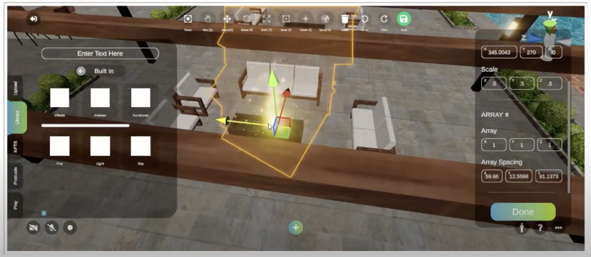  

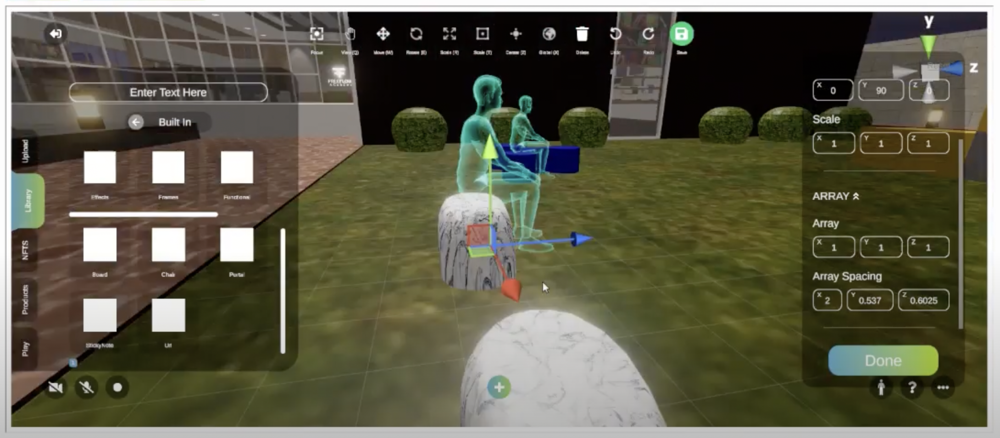  

## Shopping

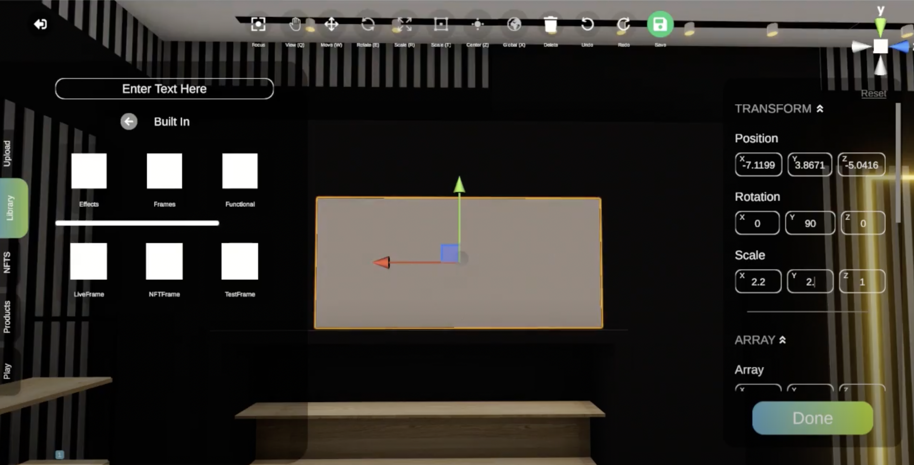  

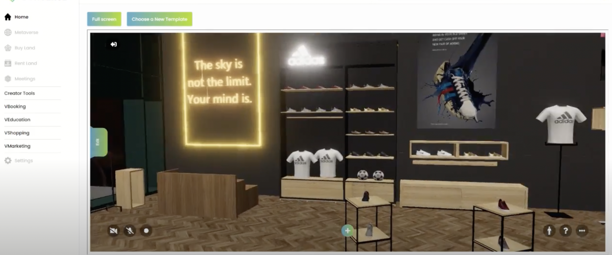  

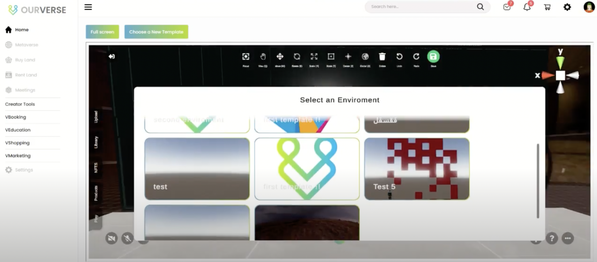  
  
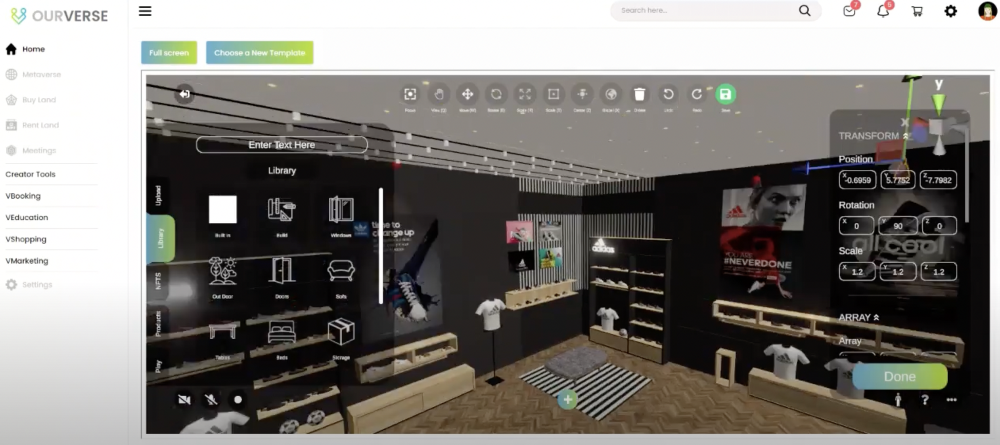  

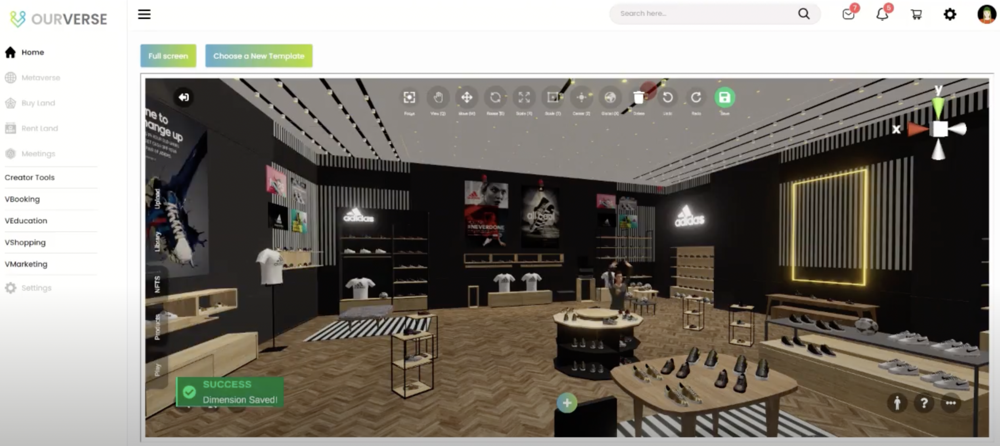  

## Roadmap

- Q1 2023: 
    - authentication with our freeflow twin
    - everyone can expand the metaverse starting from their twin
    - integrated education & ecommerce capabilities
    - use digital currencies for developing your own metaverse experiences
- Q2 2023
    - the introduction of OurVerse Token (OVT) which allows anyone to earn money by expanding the metaverse
    - TBD