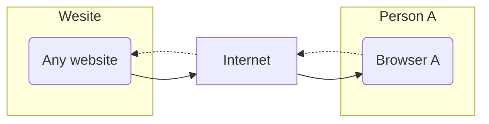
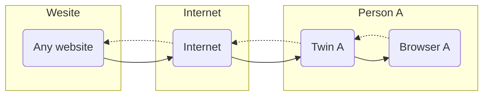
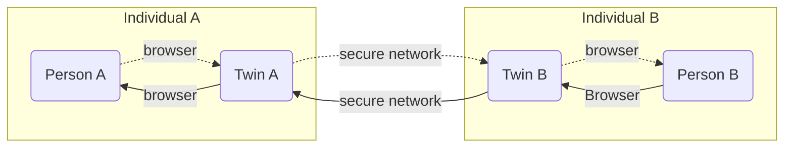

<div style="text-align: center;">


</div>

## My Private Safe Browser

Browsing the internet present risks. There are many sites which have malicious codes embedded in what look like harmless web pages. These malicious contents get uploaded to your browser and might trick you in agreeing malicious codes in your local browser or you local machine. This is a fairly common practice and people are being tricked into providing information of access to others which they should not.

The Surf Safe option of the twin provides a virtual browser on the twin that browses the internet on behalf off the person who operates the twin.



In order to make this safe, the Twin can perform the browsing activities and send the rendered screen(s) back to the person that is browsing as a stream, much like a netflix stream comes to the browser.



> TODO:



```

```

