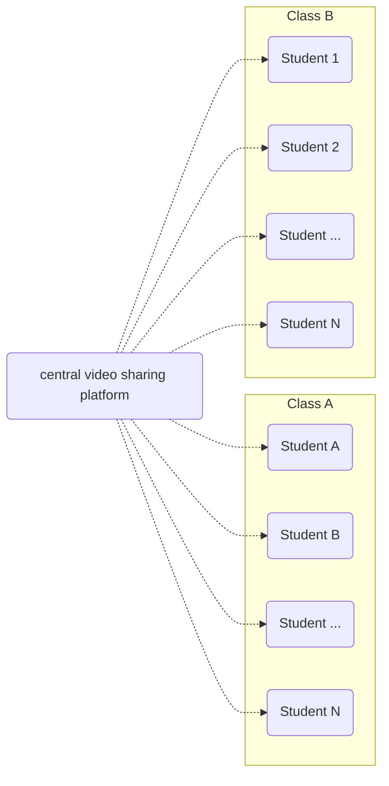
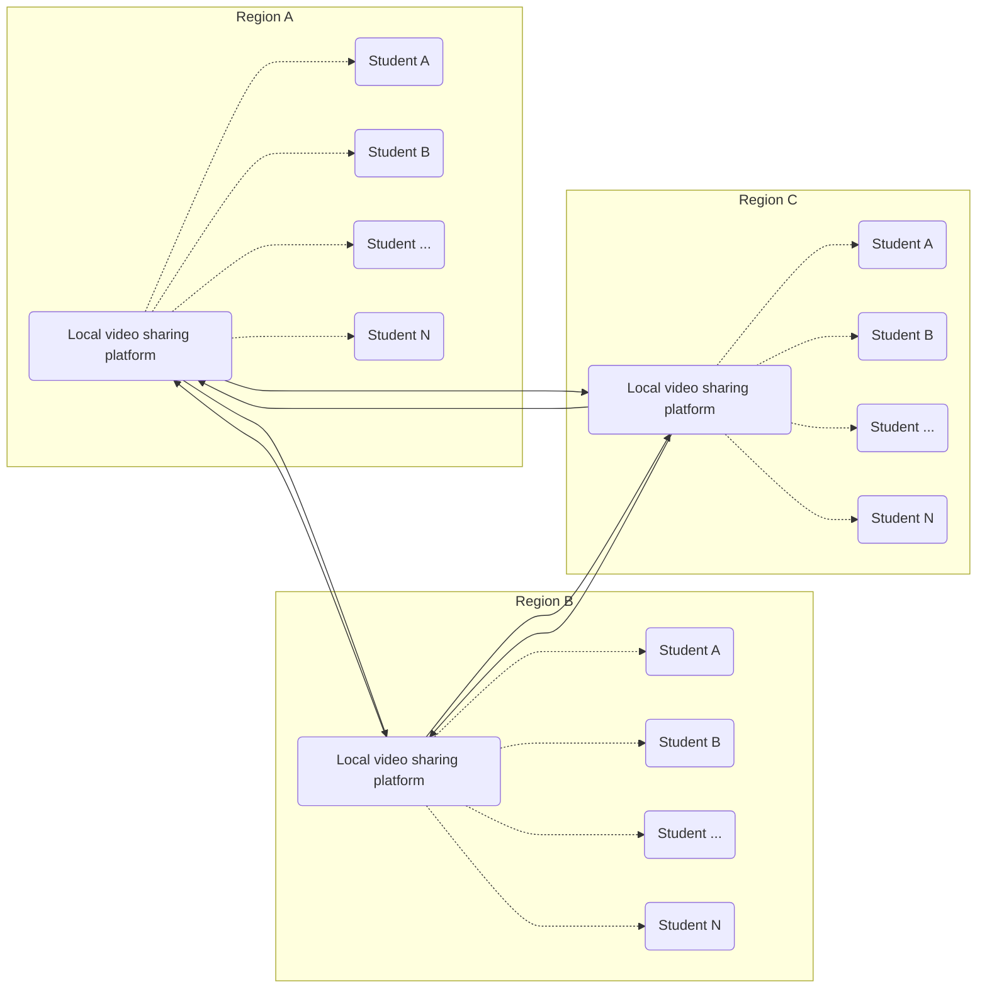

# Video Share

  

> TODO: explain more

## Architecture

```mermaid
graph LR
    VIDEOPLATFORM .-> INDIVIDUALA
    VIDEOPLATFORM .-> INDIVIDUALB
    VIDEOPLATFORM .-> INDIVIDUALC
    VIDEOPLATFORM .-> INDIVIDUALD
    
    subgraph Class A
    INDIVIDUALA(Student A)
    INDIVIDUALB(Student B)
    INDIVIDUALH(Student ...)
    INDIVIDUALI(Student N)
    end
    
    VIDEOPLATFORM(central video sharing platform)
    
    subgraph Class B
    INDIVIDUALC(Student 1)
    INDIVIDUALD(Student 2)
    INDIVIDUALJ(Student ...)
    INDIVIDUALK(Student N)
    end


    VIDEOPLATFORM .-> INDIVIDUALH
    VIDEOPLATFORM .-> INDIVIDUALI
    VIDEOPLATFORM .-> INDIVIDUALJ
    VIDEOPLATFORM .-> INDIVIDUALK
```

versus a more decentralized approach:

```mermaid
graph LR
    subgraph Region A
    INDIVIDUALAA(Student A)
    INDIVIDUALAB(Student B)
    INDIVIDUALAC(Student ...)
    INDIVIDUALAD(Student N)
    VIDEOPLATFORMA(Local video sharing platform)
    VIDEOPLATFORMA .-> INDIVIDUALAA
    VIDEOPLATFORMA .-> INDIVIDUALAB
    VIDEOPLATFORMA .-> INDIVIDUALAC
    VIDEOPLATFORMA .-> INDIVIDUALAD
    end

    subgraph Region B
    INDIVIDUALBA(Student A)
    INDIVIDUALBB(Student B)
    INDIVIDUALBC(Student ...)
    INDIVIDUALBD(Student N)
    VIDEOPLATFORMB(Local video sharing platform)
    VIDEOPLATFORMB .-> INDIVIDUALBA
    VIDEOPLATFORMB .-> INDIVIDUALBB
    VIDEOPLATFORMB .-> INDIVIDUALBC
    VIDEOPLATFORMB .-> INDIVIDUALBD
    end   

    subgraph Region C
    INDIVIDUALCA(Student A)
    INDIVIDUALCB(Student B)
    INDIVIDUALCC(Student ...)
    INDIVIDUALCD(Student N)
    VIDEOPLATFORMC(Local video sharing platform)
    VIDEOPLATFORMC .-> INDIVIDUALCA
    VIDEOPLATFORMC .-> INDIVIDUALCB
    VIDEOPLATFORMC .-> INDIVIDUALCC
    VIDEOPLATFORMC .-> INDIVIDUALCD
    end   
    VIDEOPLATFORMA --> VIDEOPLATFORMB
    VIDEOPLATFORMB --> VIDEOPLATFORMA
    VIDEOPLATFORMA --> VIDEOPLATFORMC
    VIDEOPLATFORMC --> VIDEOPLATFORMA
    VIDEOPLATFORMB --> VIDEOPLATFORMC
    VIDEOPLATFORMC --> VIDEOPLATFORMB
```

