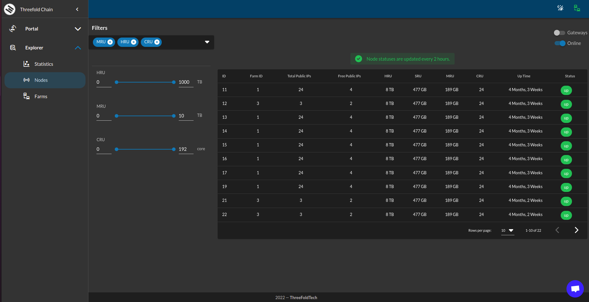
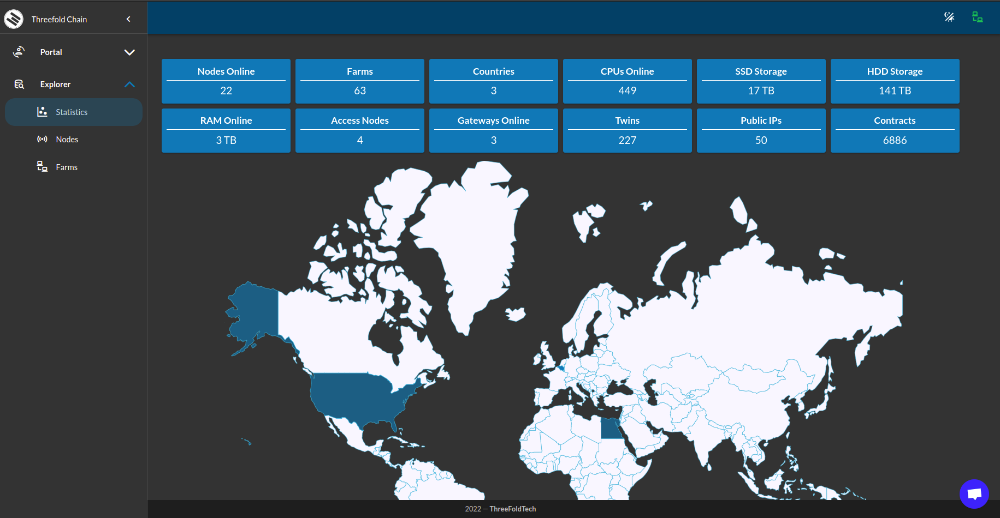
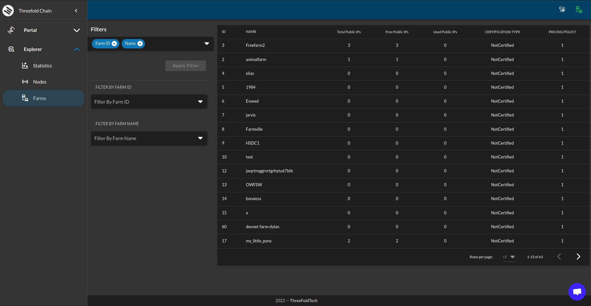
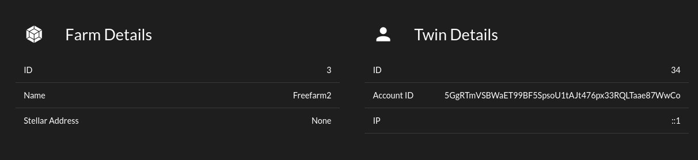
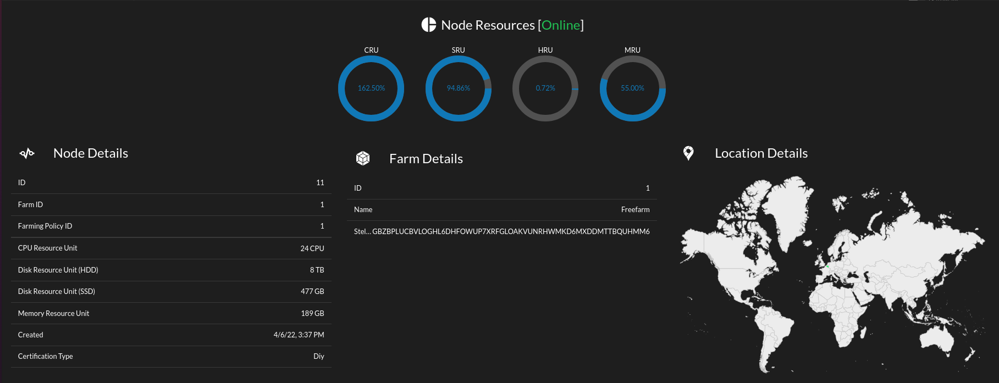
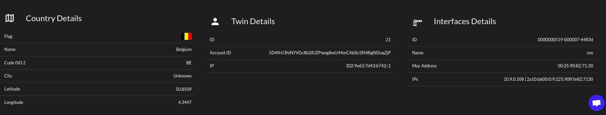
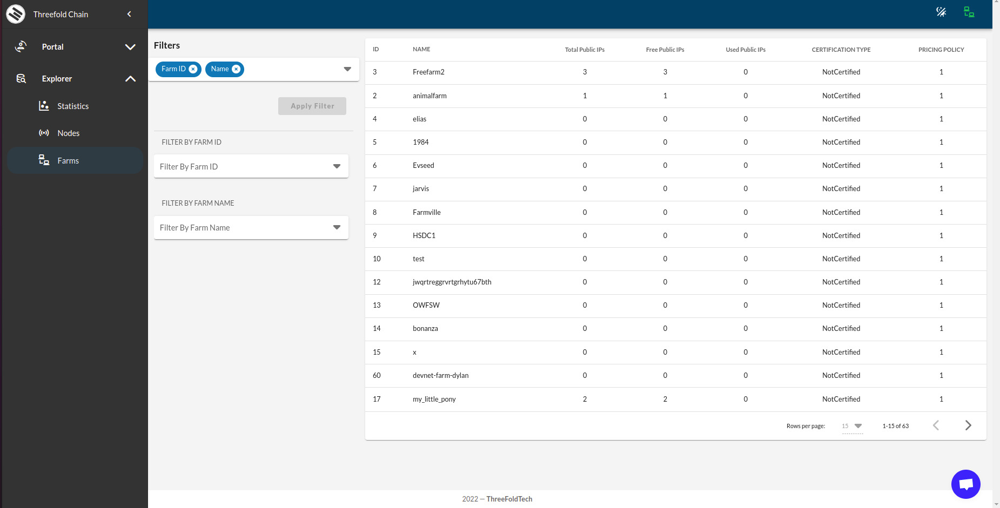

# Explorer

The explorer allows you to find nodes in the grid which fulfil your requirements

##  Current Explorer List

- [Devnet Explorer](https://dashboard.dev.grid.tf)
- [Qanet Explorer](https://dashboard.qa.grid.tf)
- [Testnet Explorer](https://dashboard.test.grid.tf)
- [Mainnet explorer](https://dashboard.grid.tf) 

## ExplorerUI

Explorer UI helps exploring the capacity connected to Threefold Grid. Searching for nodes, farms, gateways .. etc. It also supports Dark mode for more comfortable navigation.

###  Statistics

Here you can see generic overview about

- number of farms
- number of nodes
- number of gateways
- number of twins
- number of contracts
- the capacity CRU, SRU, HRU, MRU
- the number of public IPs available

###  Exploring Farms

You can see a list of all farms with filtering options

###  Farm Details

Click on a farm shows up the farm details information

###  Exploring Nodes

Explorer UI allows exploring the nodes and filtering them by many filtering option

You can see all of the node details by clicking on a node record.

-----

Lightmode is supported. Click on the icon in the upper right corner of the screen.

Can also see a map of how the capacity is distributed.
A map is available with a global overview, showing in which countries capacity is offered.

