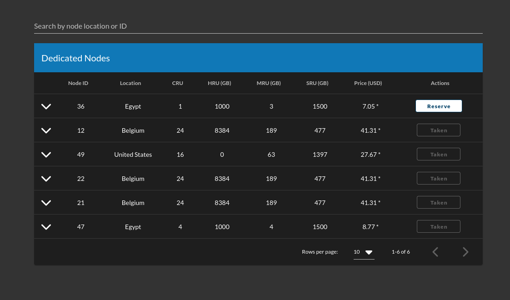
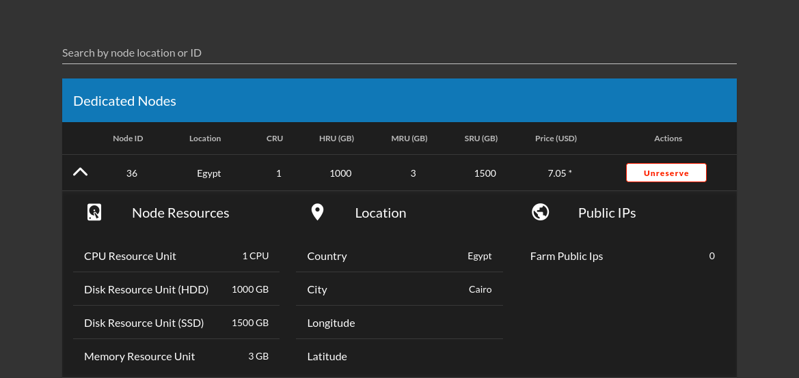
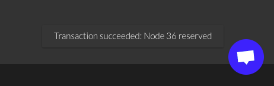

## What is Dedicated Node?

A user can reserve an entire node then use it exclusively to deploy solutions.

### Discription

- Node reserved with deploying a `RentContract` on this node. node can has only one rentContract.
- When a user create a RentContract against a node, the grid validate that there are no other active contracts on that node on the creation.
- Once a RentContract is created, the grid can only accept contracts on this node from the tenant.
- Only workloads from the tenant are accepted

### Billing & Pricing

- Once a node is rented, there is a fixed charge billed to the tenant regardless of deployed workloads.
- Any subsequent NodeContract deployed on a node where a rentContract is active (and the same user is creating the nodeContracts) can be excluded from billing (apart from public ip and network usage).
- Reseved Disounts for renting a node on TFGrid internet capacity
  - 70% for dedicated node (TF Pricing policies)
  - a second level discount up to 60% for balance level see [Discount Levels](https://library.threefold.me/info/threefold/#/tfgrid/grid/pricing?id=discount-levels)

### Usage

- See list of all dedicated node on `Dedicated Nodes` tab on the portal.

    
  - Hover on price to see discount
  - Expand row to see more info on the node:
  
    
    - Resources
    - Location
    - Possible Public Ips *this dependes on the farm it belongs to*

  - You can see the nodes in 3 states:
    - Free
    - Reserved *Owned by current twin*
    - Taken *Owned by another twin*
- Reserve a node:
  - If node is not rented by another twin you can simply click reserve.
  - Type your password on the polkadot pop up window.
  - Wait for the pop up message said `Transaction succeeded`

    

- Unreserve a node:
  - Simply as reserving but another check will be done to check you don't have any active workoad on the node before unreserving.
