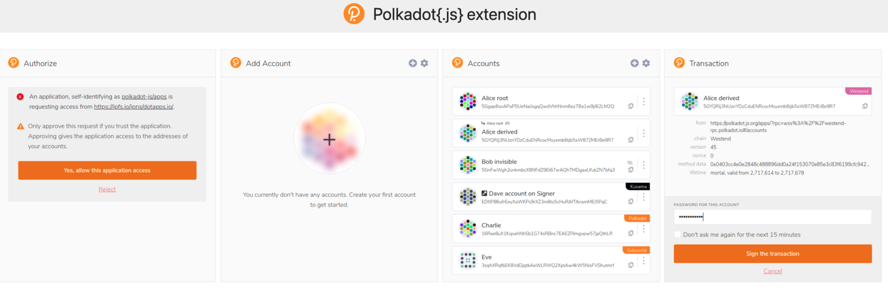

# Polkadot Extension

## What does it do

This browser extension manages accounts and allows the signing of transactions with those accounts. It does not inject providers for use by dapps at this early point, nor does it perform wallet functions, e.g send funds.

## Install

Before using the tfchain_portal, you need to install a Polkadot extension.

It can be installed from [here](https://polkadot.js.org/extension/).

Extensions are available for the Google Chrome and Firefox browsers.

