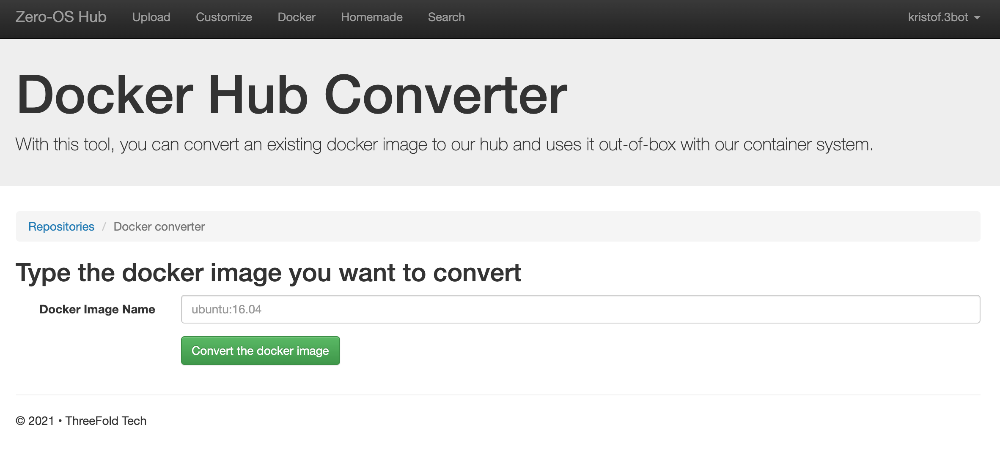
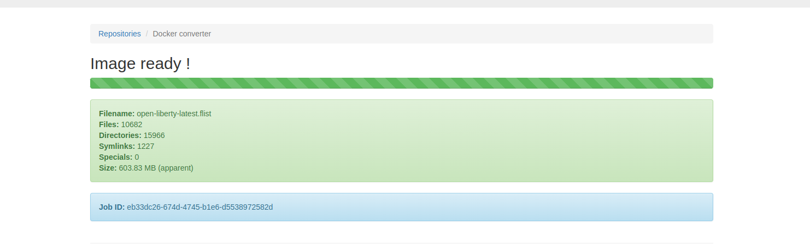
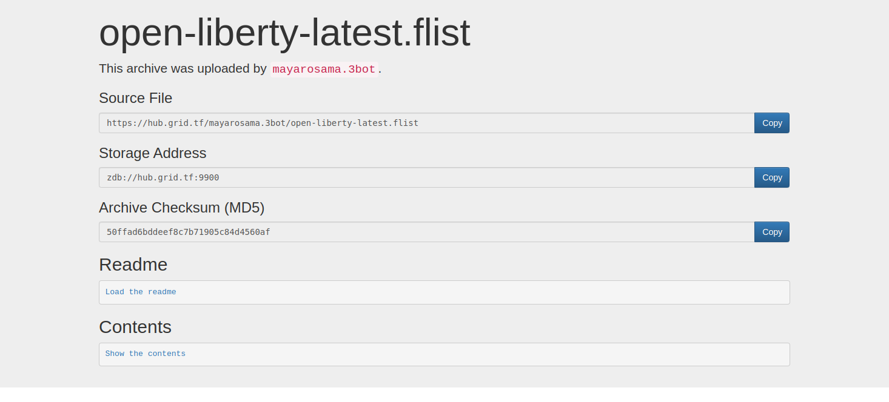

# Convert Docker To Flist

1. Upload the Docker image to Docker Hub with the following command:

```bash
docker push <image_name>
```

2. Navigate to the docker converter link: https://hub.grid.tf/docker-convert
   

3. Copy the name of the uploaded Docker image to the Docker Image Name field.

4. Then press the convert button.

When the image is ready, some information will be displayed.



To Navigate to the created Flist Either search with the newly created file name in the search tab.


Or Navigate to your repository in the contributers section from the Zero-Os Hub and navigate to the newly created Flist.

Then press the preview button to display the Flist's url and some other data.


