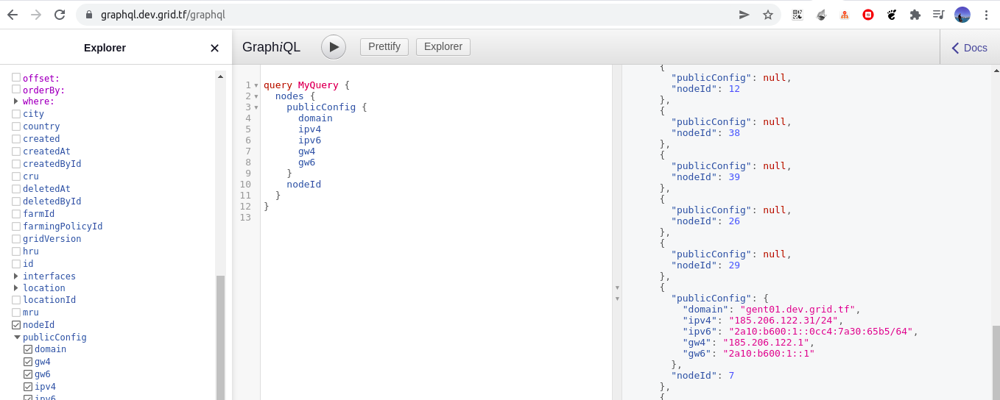

# Terraform Web Gateway With VM

## expose with prefix

A complete list of gateway name workload parameters can be found [here](https://github.com/threefoldtech/terraform-provider-grid/blob/development/docs/resources/name_proxy.md).
!!!code url:'https://github.com/threefoldtech/terraform-provider-grid/blob/development/examples/resources/expose-vm/main.tf'


please note to use grid_name_proxy you should choose a node that has public config and has a domain in its public config like node 7 in the following example



Here 
- we created a grid domain resource `ashraf` to be deployed on gateway node `7` to end up with a domain `ashraf.ghent01.devnet.grid.tf`
- we create a proxy for the gateway to send the traffic coming to `ashraf.ghent01.devnet.grid.tf` to the vm as a backend, we say `tls_passthrough is false` to let the gateway terminate the traffic, if you replcae it with `true` your backend service needs to be able to do the TLS termination


## expose with fulldomain

A complete list of gateway fqdn workload parameters can be found [here](https://github.com/threefoldtech/terraform-provider-grid/blob/development/docs/resources/fqdn_proxy.md).

it is more like the above example the only difference is you need to create an `A record` on your name provider for `remote.omar.grid.tf`  to gateway node `7` IPv4.

```

resource "grid_fqdn_proxy" "p1" {
  node = 7
  name = "workloadname"
  fqdn = "remote.omar.grid.tf"
  backends = [format("http://%s", split("/", grid_deployment.d1.vms[0].computedip)[0])]
  tls_passthrough = true
}

output "fqdn" {
    value = grid_fqdn_proxy.p1.fqdn
}
```


