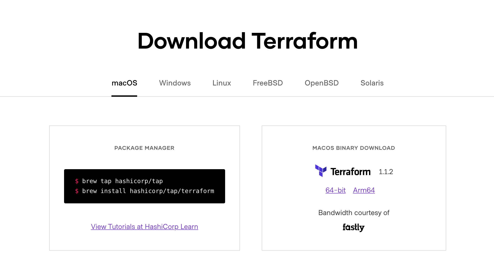

### Terraform Install

Please note that for now our [Terraform plugin](https://github.com/threefoldtech/terraform-provider-grid) is supported on Linux and MacOS. Windows

Get Terraform from the [download page](https://www.terraform.io/downloads.html) on the official site, or install using you system's package manager. please check the [installation manual](https://learn.hashicorp.com/tutorials/terraform/install-cli)

There's no need to specifically install the ThreeFold Terraform plugin. Terraform will automatically load it from an online directory according to instruction within the deployment file.
