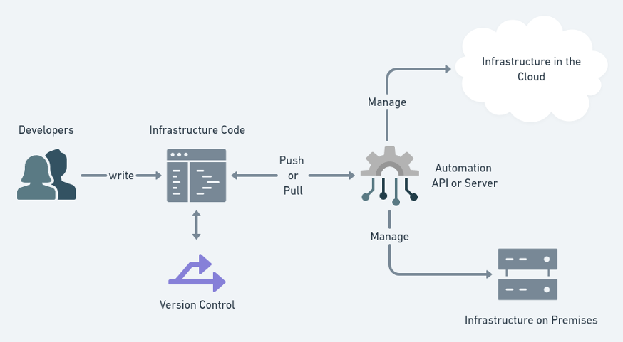

# Infrastructure As Code

Infrastructure as code is the process of managing and provisioning computer data centers through machine-readable definition files, rather than physical hardware configuration or interactive configuration tools.

## Advantages

1. Faster speed and consistency: The goal of IaC is to make things faster by eliminating manual processes and eliminating the slack in the process. A code-based approach makes it easier to get more done in less time. No need to wait on the IT Admin to manually complete the task at hand before he can get to the next one. This also means that you can iterate quickly and more often. Consistency is another vital benefit of IaC. You do not need to worry about tasks not being completed because it is a weekend or because your admin is focused on something else. Also, you can implement changes globally while keeping the same version of the software, etc.
2. Efficient software development lifecycle: IaC shifts the power into the developer’s hands. As the infrastructure provisioning becomes more reliable and consistent, developers can start focusing on application development more. Also, they can script once and use that code multiple times, thus, saving time and effort while keeping complete control.
3. Reduced management overhead: In a data center world there was a need to have admins to govern and manage storage, networking, compute and other layers of hardware and middleware. IaC eliminates a need for these multiple roles. Those admins can now focus on identifying the next exciting technology they want to implement.

## Our main tool = Terraform

Is an opensource IAC tool, fully integrated with ThreeFold Cloud software.

## Links

- [What you need to know](@grid3_developer_basics)
- [Terraform](@grid3_terraform_home)
- [TypeScript Client](@grid3_javascript_home)
- [GraphQL Client](@graphql)
- [Grid Proxy REST API](@grid_proxy)

*more info: wikipedia, [cloudbolt](https://www.cloudbolt.io/blog/3-advantages-and-challenges-of-infrastructure-as-code-iac/),[stackpath(https://blog.stackpath.com/infrastructure-as-code-explainer/)*
