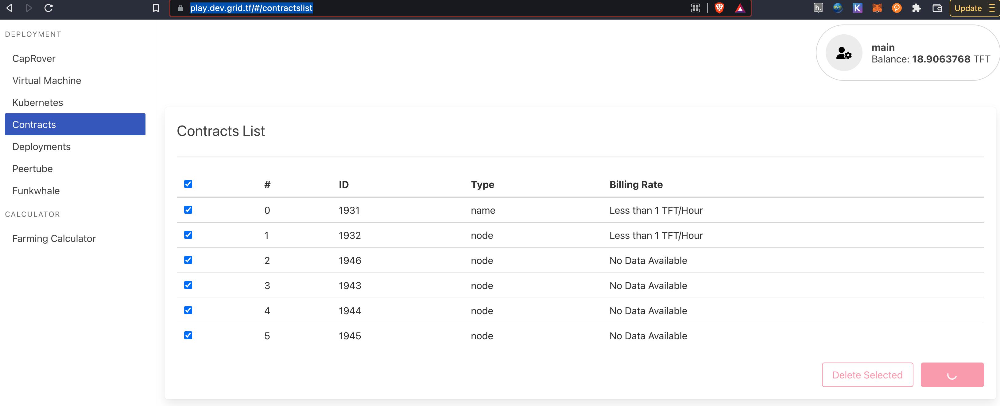

# Terraform Delete

## Use Terraform

go in directory of your terraform deployment

do:

```
terraform destroy
```

## Use Weblets To Delete From Blockchains

go to [https://play.dev.grid.tf/#/contractslist](https://play.dev.grid.tf/#/contractslist)

or

[https://play.grid.tf/#/contractslist](https://play.grid.tf/#/contractslist)



select the contracts you want to cancel.

There is a select all button this makes sure your account you use has nothing left

> Its not always easy to see what to delete, this feature is there as a last resort. We will improve visibility in future.

## Easier management of resources (TIP)

Use multiple accounts on TFChain, group your resources per account. 

This gives you following benefits

- more control over TFT spending
- easier to delete all your contracts
- less chance to make mistakes
- can use an account to share access with multiple people

