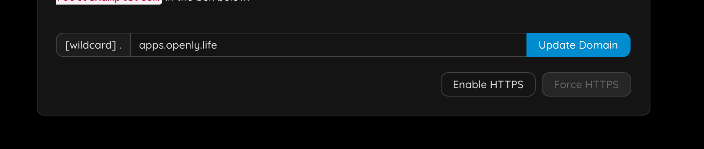
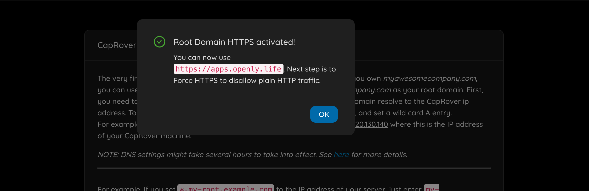
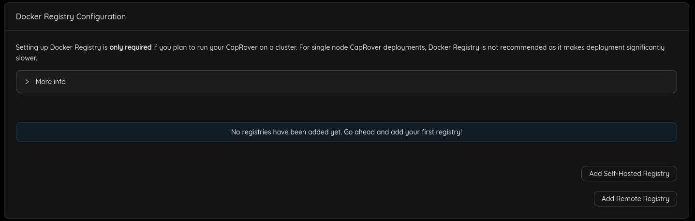
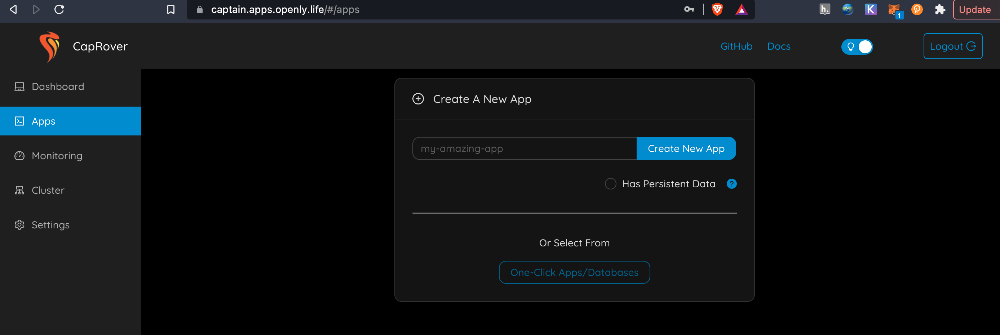
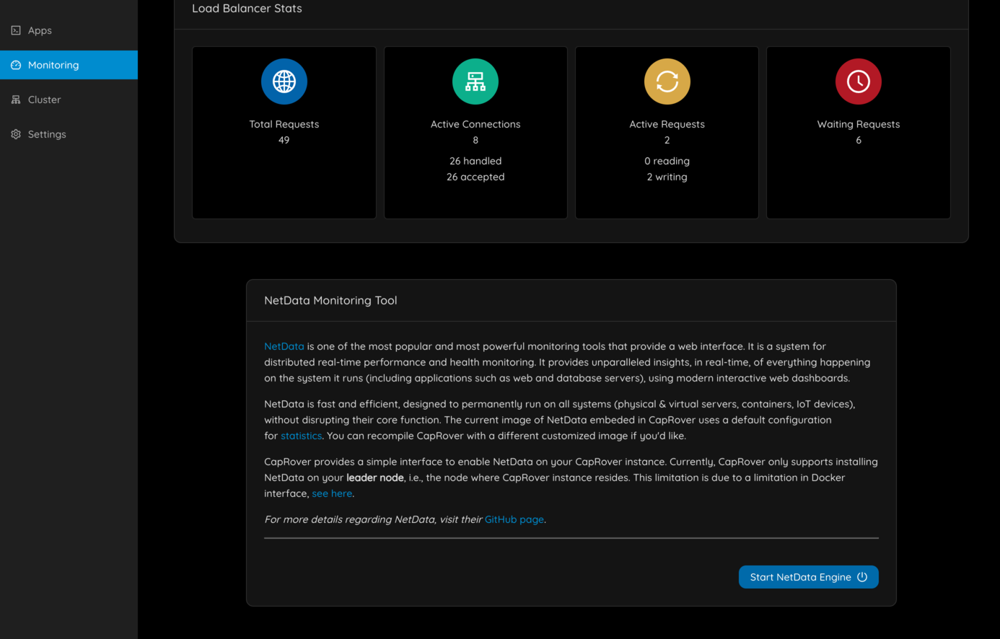
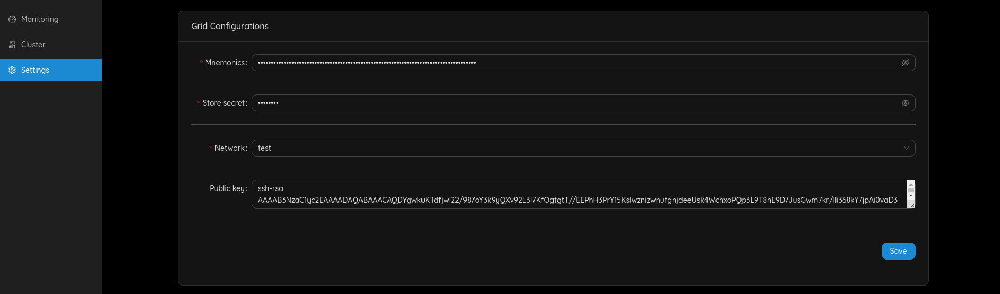
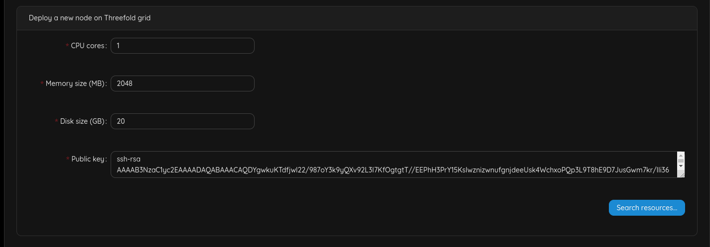
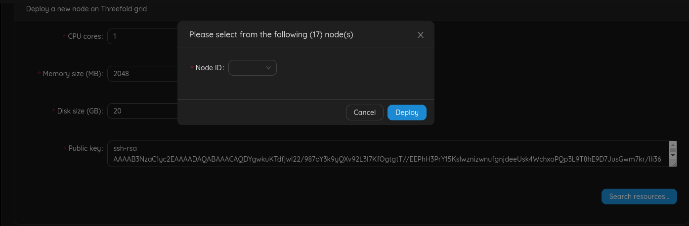
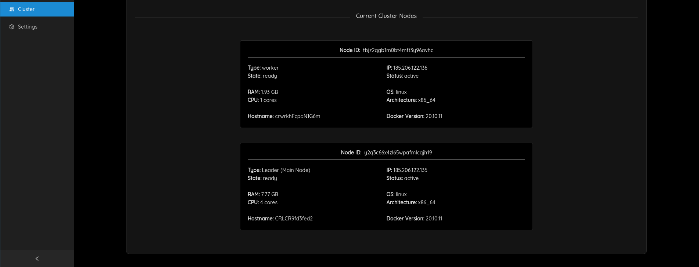

# Manage Caprover

## Step 1: Enable https

You need to specify your email address.

You will have to login again.

> Now force https.

You will have to login again, and you should notice https is now used.

## Step 2: Add a default docker registry
You'll have to add a default docker registry so other CapRover nodes in the cluster can download images from, and it can be self-hosted (managed by CapRover itself), to add it, go to `Cluster` -> `Docker Registry Configuration`.

You can check [official documentation](https://caprover.com/docs/app-scaling-and-cluster.html#setup-docker-registry) to know more about Docker registry options.
## Step 3: Deploy an app

just go to apps & follow the instructions, there is much more info on caprover website.

## Step 4: Enable monitoring

You should now see

## Step 5: Lets add nodes to caprover

- Go to the settings

- Fill in your mnemonic from TF-Chain, make sure it's the right network you are connected to
- Set your store secret for storing deployment information securely on TF-Chain.
- Add your SSH-key

Now go to `Cluster -> Deploy a new node on Threefold grid`, specify the details of the resources you need and then click **Search resources...** :

If there are enough resources, a new window will appear listing possible nodes to deploy this node to, select one of them and click **Deploy**:

You should then see something like

This should typically take less than 2 minutes.

> Important: the deployment process takes some time before it is known in CapRover.

Go out of the form and back to `Cluster`.

## Step 6: Change your password

- Go to `Settings` and change your password. This is important for your own security.
