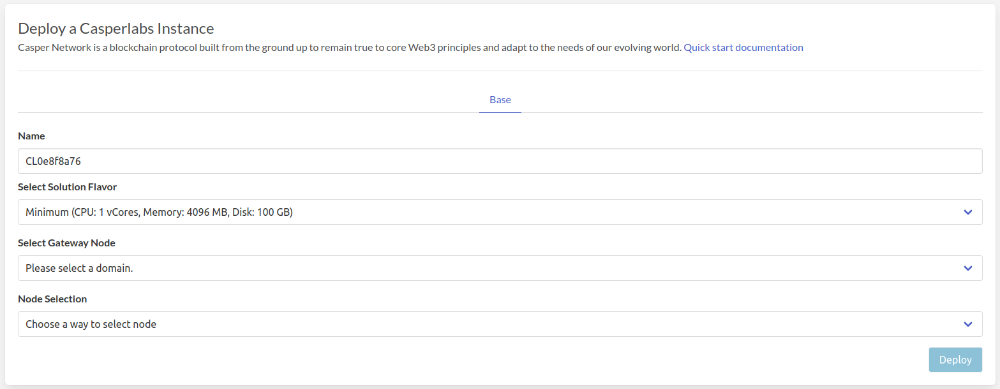
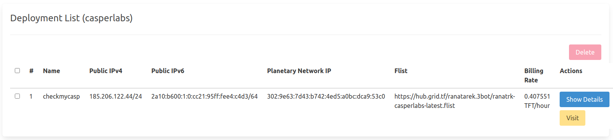
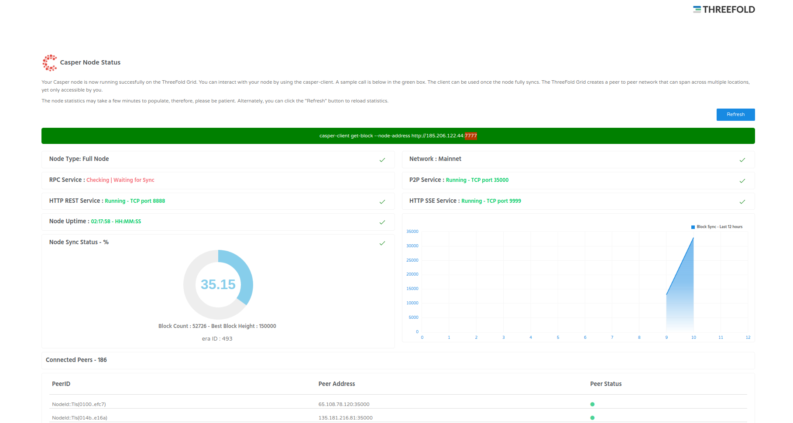

# CasperLabs

[Casper Network](https://casperlabs.io/)is a blockchain protocol built from the ground up to remain true to core Web3 principles and adapt to the needs of our evolving world.

!!!include:weblets_play_go
- Make sure you have an activated [profile](weblets_profile_manager)
- Click on the **Casperlabs** tab

__Process__ :

- Enter an Application Name. It's used in generating a unique subdomain on one of the gateways on the network alongside your twin ID. Ex. ***cl98casp*.gent02.dev.grid.tf**

- Select a capacity package:
    - **Minimum**: {cpu: 1, memory: 1024 * 4, diskSize: 100 }
    - **Standard**: {cpu: 2, memory: 1024 * 16, diskSize: 500 }
    - **Recommended**: {cpu: 4, memory: 1024 * 32, diskSize: 1000 }
    - Or choose a **Custom** plan
- Choose a gateway node to deploy your CasperLabs instance on.

- Choose a node to deploy your Casperlabs instance on.

    - Either use the **Capacity Filter**. Which simply lets you pick a *Farm* and *Country*, after clicking on *Apply filters and suggest nodes* then it lists available nodes with these preferences and you pick.

    - Or use **Manual** and type a specific node number to deploy on.

After that is done you can see a list of all of your deployed instances

Click on ***Visit*** to go to the homepage of your Casperlabs instance! The node takes a long time in order for the RPC service to be ready so be patient!

