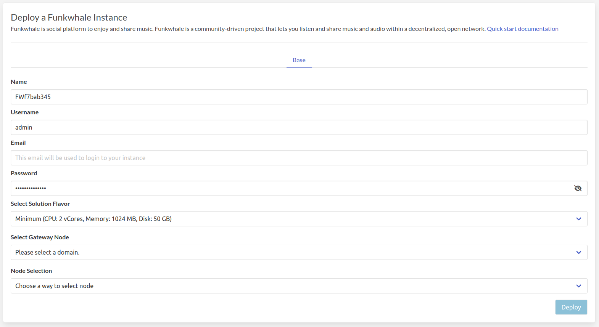
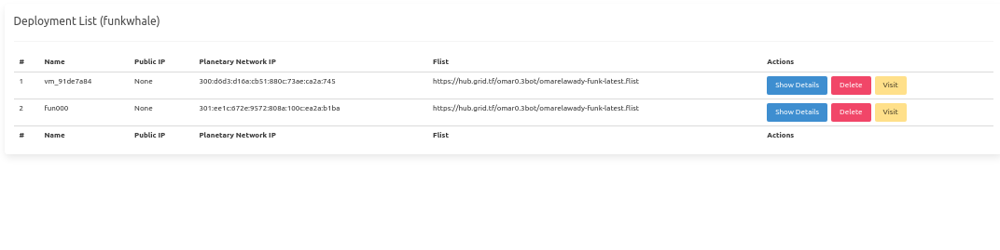
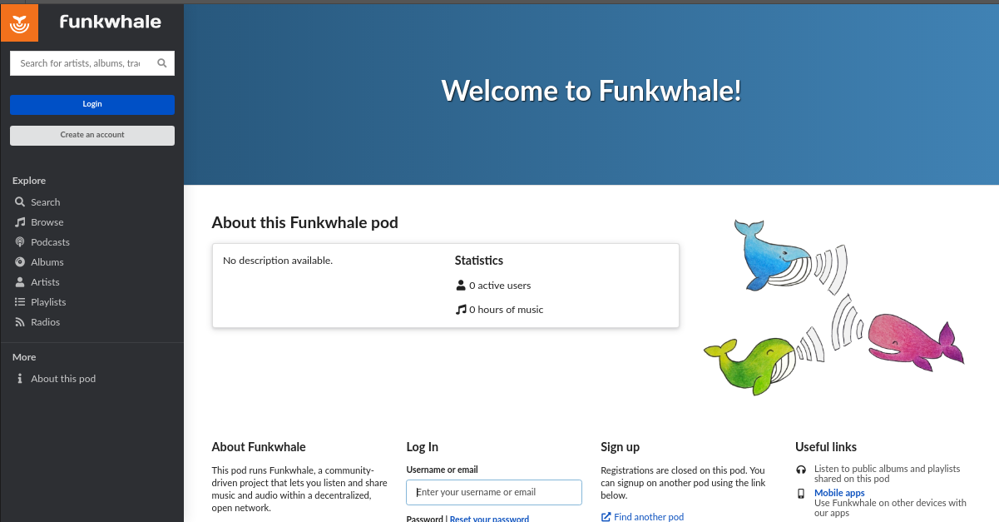

# Funkwhale

[Funkwhale](https://funkwhale.audio/) is social platform to enjoy and share music.
Funkwhale is a community-driven project that lets you listen and share music and audio within a decentralized, open network.

!!!include:weblets_play_go
- Make sure you have an activated [profile](weblets_profile_manager)
- Click on the **Funkwhale** tab

__Process__ :

- Enter an Application Name. It's used in generating a unique subdomain on one of the gateways on the network alongside your twin ID. Ex. ***fw100myfunk*.gent02.dev.grid.tf**

- Enter administrator information including **Username**, **Email** and **Password**. This admin user will have full permission on the deployed instance.

- Select a capacity package:
    - **Minimum**: {cpu: 2, memory: 1024, diskSize: 50 }
    - **Standard**: {cpu: 2, memory: 1024 * 2, diskSize: 100 }
    - **Recommended**: {cpu: 4, memory: 1024 * 4, diskSize: 250 }
    - Or choose a **Custom** plan
- Choose a gateway node to deploy your Funkwhale instance on.

- Select a node to deploy your Funkwhale instance on.
    - Either use the **Capacity Filter**. Which simply lets you pick a *Farm* and *Country*, after clicking on *Apply filters and suggest nodes* then it lists available nodes with these preferences and you pick.

    - Or use **Manual** and type a specific node number to deploy on.

After that is done you can see a list of all of your deployed instances

Click on ***Visit*** to go to the homepage of your Funkwhale instance!

