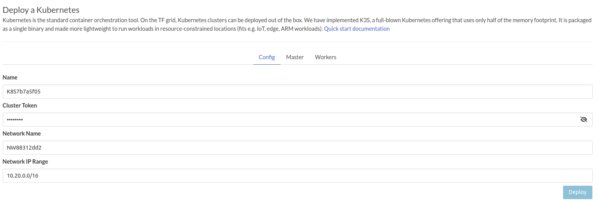
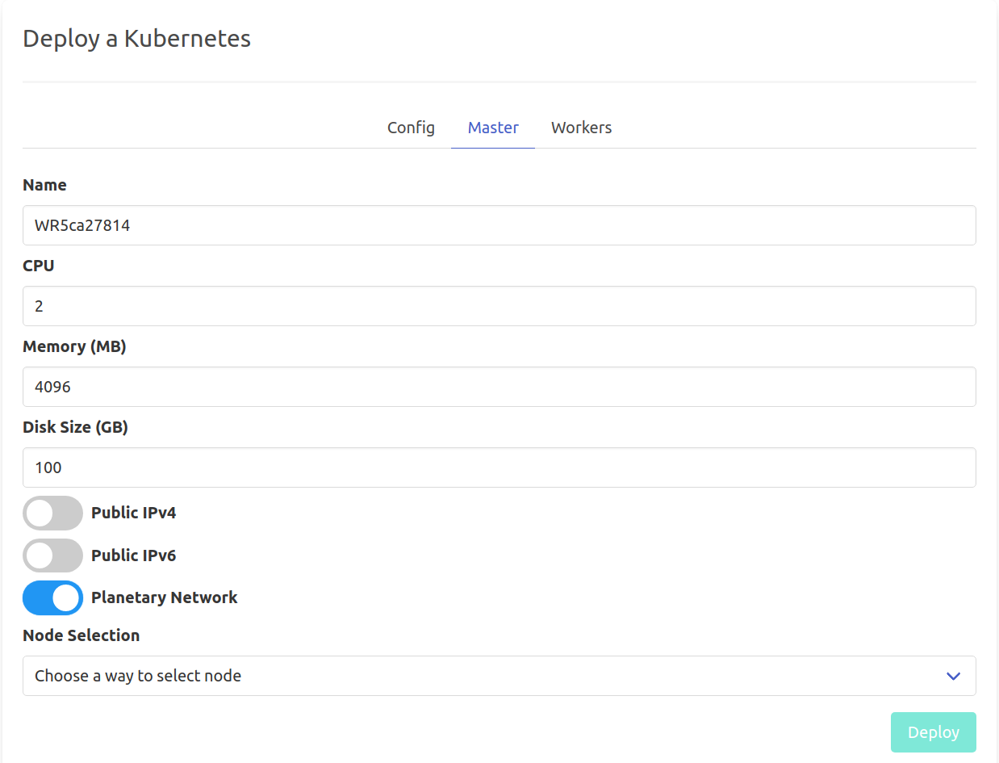
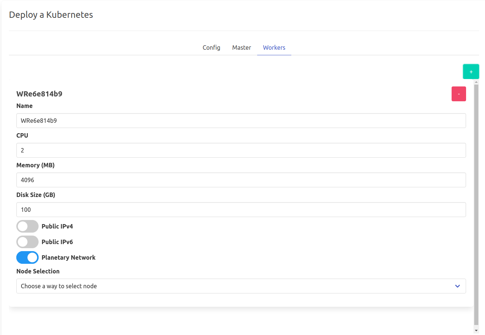
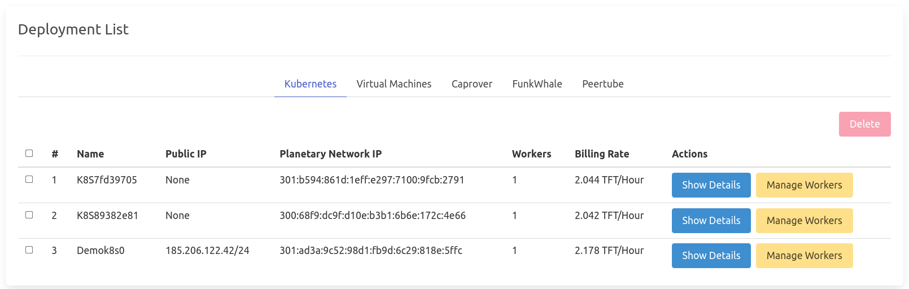
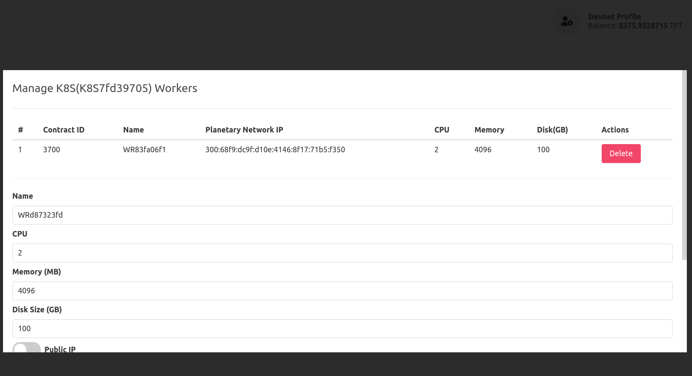
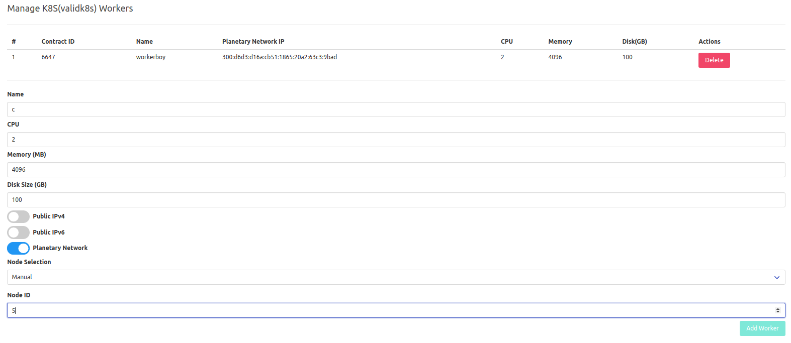
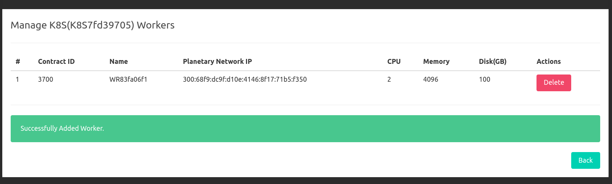

# Kubernetes 

Kubernetes is the standard container orchestration tool.

On the TF grid, Kubernetes clusters can be deployed out of the box. We have implemented [K3S](https://k3s.io/), a full-blown Kubernetes offering that uses only half of the memory footprint. It is packaged as a single binary and made more lightweight to run workloads in resource-constrained locations (fits e.g. IoT, edge, ARM workloads).

!!!include:weblets_play_go
- Make sure you have an activated [profile](weblets_profile_manager) 
- Click on the **Kubernetes** tab

### **Configs** tab



- `Name`: Your Kubernetes Cluster name.
- `Cluster Token`: It's used for authentication between your worker nodes and master node. You could use the auto-generated one or type your own.
- `Network Name`: It's used for Wireguard's private network.
- `Network IP Range`: It's a private subnet for Wireguard's network. You could use the auto-generated one or replace it with a **private** subnet.

### **Master** and **Worker** tabs




> Currently, we only support "single-master-multi-worker" k8s clusters. So you could always add more than one worker node by clicking on the **+** in the ***Worker*** tab.


### Kubeconfig
Once the cluster is ready, you can SSH into the cluster using `ssh root@IP`
> IP can be the public IP or the planetary network IP

Onced connected via SSH, you can execute commands on the cluster like `kubectl get nodes`, and to get the kubeconfig, you can find it in `/root/.kube/config` 

> if it doesn't exist in `/root/.kube/config` it can be in `/etc/rancher/k3s/k3s.yaml`

example:

```
root@WR768dbf76:~# cat /root/.kube/config 
apiVersion: v1
clusters:
- cluster:
    certificate-authority-data: LS0tLS1CRUdJTiBDRVJUSUZJQ0FURS0tLS0tCk1JSUJkakNDQVIyZ0F3SUJBZ0lCQURBS0JnZ3Foa2pPUFFRREFqQWpNU0V3SHdZRFZRUUREQmhyTTNNdGMyVnkKZG1WeUxXTmhRREUyTkRBeU5qWTBNVE13SGhjTk1qRXhNakl6TVRNek16TXpXaGNOTXpFeE1qSXhNVE16TXpNegpXakFqTVNFd0h3WURWUVFEREJock0zTXRjMlZ5ZG1WeUxXTmhRREUyTkRBeU5qWTBNVE13V1RBVEJnY3Foa2pPClBRSUJCZ2dxaGtqT1BRTUJCd05DQUFUcGNtZE1KaWg1eGFTa1JlelNKVU5mUkQ5NWV6cE12amhVeUc2bWU4bTkKY0lQWENoNUZ2ZU81Znk1d1VTSTlYOFlGV2JkOGtRcG9vaVdVbStwYjFvU3hvMEl3UURBT0JnTlZIUThCQWY4RQpCQU1DQXFRd0R3WURWUjBUQVFIL0JBVXdBd0VCL3pBZEJnTlZIUTRFRmdRVUtkL3VUU3FtWk12bHhtcWNYU3lxCmVhWERIbXd3Q2dZSUtvWkl6ajBFQXdJRFJ3QXdSQUlnSUQ0cGNQWDl2R0F6SC9lTkhCNndVdmNZRi9HbXFuQVIKR2dqT1RSdWVia1lDSUdRUmUwTGJzQXdwMWNicHlYRWljV3V0aG1RQ1dwRXY1NThWZ3BoMFpETFAKLS0tLS1FTkQgQ0VSVElGSUNBVEUtLS0tLQo=
    server: https://127.0.0.1:6443
  name: default
contexts:
- context:
    cluster: default
    user: default
  name: default
current-context: default
kind: Config
preferences: {}
users:
- name: default
  user:
    client-certificate-data: LS0tLS1CRUdJTiBDRVJUSUZJQ0FURS0tLS0tCk1JSUJrVENDQVRlZ0F3SUJBZ0lJWnptV1A4ellKaGd3Q2dZSUtvWkl6ajBFQXdJd0l6RWhNQjhHQTFVRUF3d1kKYXpOekxXTnNhV1Z1ZEMxallVQXhOalF3TWpZMk5ERXpNQjRYRFRJeE1USXlNekV6TXpNek0xb1hEVEl5TVRJeQpNekV6TXpNek0xb3dNREVYTUJVR0ExVUVDaE1PYzNsemRHVnRPbTFoYzNSbGNuTXhGVEFUQmdOVkJBTVRESE41CmMzUmxiVHBoWkcxcGJqQlpNQk1HQnlxR1NNNDlBZ0VHQ0NxR1NNNDlBd0VIQTBJQUJINTZaZGM5aTJ0azAyNGQKcXBDQ2NRMndMMjc1QWtPZUFxalIzQjFTTGFQeG1oOG9IcXd4SzY2RTc1ZWQya2VySFIySnBZbWwwNE5sa0grLwpSd2kvMDNDalNEQkdNQTRHQTFVZER3RUIvd1FFQXdJRm9EQVRCZ05WSFNVRUREQUtCZ2dyQmdFRkJRY0RBakFmCkJnTlZIU01FR0RBV2dCVGhPakJSaExjeE53UDkzd0xtUzBYRUFUNjlSekFLQmdncWhrak9QUVFEQWdOSUFEQkYKQWlBcjdDcDR2dks4Y2s0Q0lROEM5em5zVkFUZVhDaHZsUmdvanZuVXU4REZld0loQUlwRVYyMWJZVXBpUEkzVQowa3QvQmJqRUtjV1poVXNHQ0g0YzVNWTFFS0JhCi0tLS0tRU5EIENFUlRJRklDQVRFLS0tLS0KLS0tLS1CRUdJTiBDRVJUSUZJQ0FURS0tLS0tCk1JSUJkekNDQVIyZ0F3SUJBZ0lCQURBS0JnZ3Foa2pPUFFRREFqQWpNU0V3SHdZRFZRUUREQmhyTTNNdFkyeHAKWlc1MExXTmhRREUyTkRBeU5qWTBNVE13SGhjTk1qRXhNakl6TVRNek16TXpXaGNOTXpFeE1qSXhNVE16TXpNegpXakFqTVNFd0h3WURWUVFEREJock0zTXRZMnhwWlc1MExXTmhRREUyTkRBeU5qWTBNVE13V1RBVEJnY3Foa2pPClBRSUJCZ2dxaGtqT1BRTUJCd05DQUFUY3NlakN3TDQ5VkZvQnJhWVRyR3ByR2lMajNKeEw4ZVcwYnpTVDBWRGUKeFlrb3hDbDlnR0N6R2p1Q2Q0ZmZmRXV0QWdFMjU5MDFBWGJCU2VnOHdlSkJvMEl3UURBT0JnTlZIUThCQWY4RQpCQU1DQXFRd0R3WURWUjBUQVFIL0JBVXdBd0VCL3pBZEJnTlZIUTRFRmdRVTRUb3dVWVMzTVRjRC9kOEM1a3RGCnhBRSt2VWN3Q2dZSUtvWkl6ajBFQXdJRFNBQXdSUUloQU5CYWRhcFFZbnlYOEJDUllNODZtYWtMNkFDM0hSenMKL2l3Ukp6TnV6YytaQWlCZm14YytDTVZHQnBrblAzR2dWSWlFMFVQWkUrOFRnRUdkTTgrdCt4V2Ywdz09Ci0tLS0tRU5EIENFUlRJRklDQVRFLS0tLS0K
    client-key-data: LS0tLS1CRUdJTiBFQyBQUklWQVRFIEtFWS0tLS0tCk1IY0NBUUVFSURXQURoZUl0RVdHWlFCc0tCSUpZTTZPeDB5TmRHQ1JjTDBTMUtvYjRTZ25vQW9HQ0NxR1NNNDkKQXdFSG9VUURRZ0FFZm5wbDF6MkxhMlRUYmgycWtJSnhEYkF2YnZrQ1E1NENxTkhjSFZJdG8vR2FIeWdlckRFcgpyb1R2bDUzYVI2c2RIWW1saWFYVGcyV1FmNzlIQ0wvVGNBPT0KLS0tLS1FTkQgRUMgUFJJVkFURSBLRVktLS0tLQo=
root@WR768dbf76:~# 

```

If you want to use kubectl through another machine, you need to change the line `server: https://127.0.0.1:6443` to be `server: https://PLANETARYIP_OR_PUBLICIP/6443`
replace PLANETARYIP_OR_PUBLICIP with the IP you want to reach th cluster through.


### Manage Workers
Add or Remove workers in any **Kubernetes cluster**.
```html
<tf-deployedlist tab="k8s"></tf-deployedlist>
```

- Kubernetes DeployedList Weblet


- Manager kubernetes workers


- Add a new worker


- Successfully added new worker


- Delete a worker
