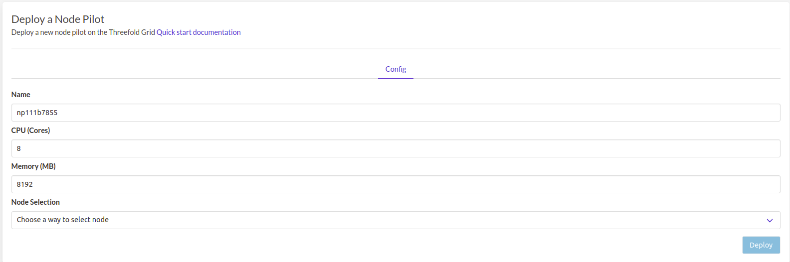
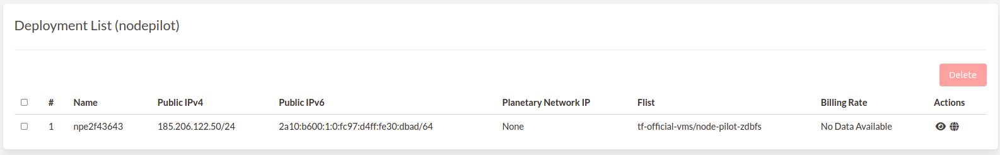
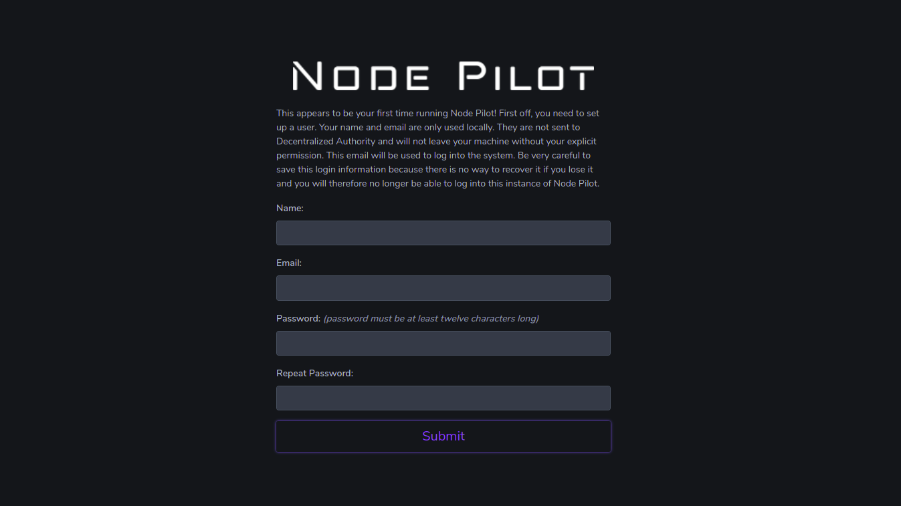

# NodePilot

This is a simple instance of upstream node-pilot: https://nodepilot.tech

!!!include:weblets_play_go
- Make sure you have an activated [profile](weblets_profile_manager)
- Click on the **Node Pilot** tab

__Process__

- Fill in the instance name: it's used to reference the node-pilot in the future.

- Minimum CPU allowed is 8 cores and minimum memory allowed is 8192.

- Select a node to deploy your node-pilot instance on.

- Either use the **Capacity Filter**. Which simply lets you pick a *Farm* and *Country*, after clicking on *Apply filters and suggest nodes* then it lists available nodes with these preferences and you pick.

- Or use **Manual** and type a specific node number to deploy on.

- When using the [flist](https://hub.grid.tf/tf-official-vms/node-pilot-zdbfs.flist) you get a node pilot instance ready out-of-box. You need to get a public ipv4 to get it to works.

After that is done you can see a list of all of your deployed instances

Click on ***Visit*** to go to the registeration page of your Node Pilot instance!

You can go to https://publicip and configure your node-pilot. You can upload a backup to the VM via ssh as well if you have a backup of a previous instance.

What change compared to upstream node-pilot, we have out-of-box a transparent pre-filled blockchain database for some blochain (currently Fuse and Pokt as proof-of-concept). You can start one of theses blockchain in no-time and it will be automatically nearly sync already without the requirement of the full space locally nor downloading everything and killing bandwidth.
