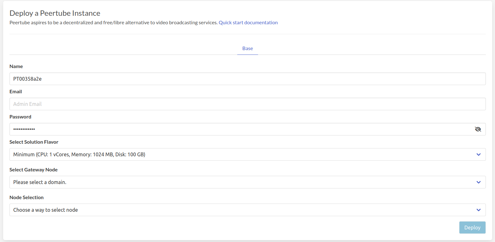
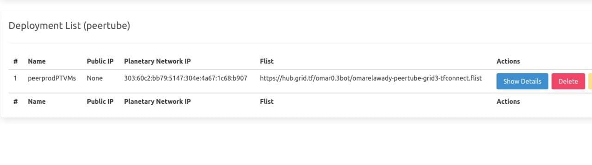
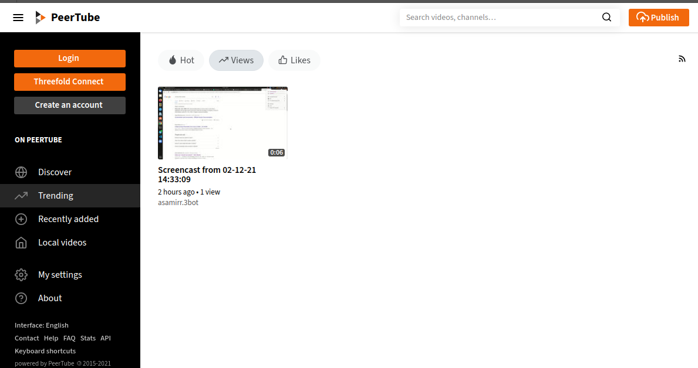

# Peertube

[Peertube](https://joinpeertube.org/) aspires to be a decentralized and free/libre alternative to video broadcasting services.

!!!include:weblets_play_go
- Make sure you have an activated [profile](weblets_profile_manager)
- Click on the **Peertube** tab

__Process__

- Enter an Application Name. It's used in generating a unique subdomain on one of the gateways on the network alongside your twin ID. 
  the applied format `<solution-code><twin-id><solution-name>.<gateway-subdomain>` Ex. ***pt100peerprod*.gent02.dev.grid.tf**
- Enter an email and password which will be used for the admin login.
- Select a capacity package:
    - **Minimum**: { cpu: 1, memory: 1024, diskSize: 100 }
    - **Standard**: { cpu: 2, memory: 1024 * 2, diskSize: 250 }
    - **Recommended**: { cpu: 4, memory: 1024 * 4, diskSize: 500 }
    - Or choose a **Custom** plan
- Choose a gateway node to deploy your Subsquid instance on.

- Select a node to deploy your Peertube instance on.

  - Either use the **Capacity Filter**. Which simply lets you pick a *Farm* and *Country*, after clicking on *Apply filters and suggest nodes* then it lists available nodes with these preferences and you pick.

  - Or use **Manual** and type a specific node number to deploy on.

After that is done you can see a list of all of your deployed instances

Click on ***Visit*** to go to the homepage of your Peertube instance!

> Please note it may take sometime to be ready