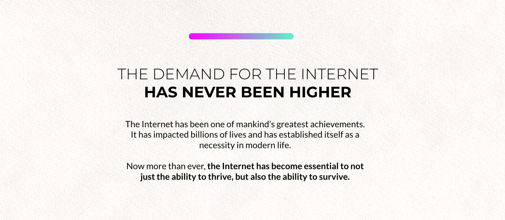

# 

# A Positive Note

We want to help countries and theirs governments 
to build their own sovereign digital future 
supporting economic growth and education, 
helping to battle security threats and climate change, 
improving equality and a regenerative future.

**VALUES and PRINCIPLES**

- **Equality**
    - We believe that everyone should be given equal chances to learn, partake, and succeed. Internet access is a human right, we commit to scale our technology to new regions to empower the unconnected. 
- **Autonomy**
    - We believe that everyone and every country should own their data and digital capabilities. Our regenerative quantum safe technology allows every user and country to be sovereign and secure.
- **Regeneration**
    - We unify our practices, partnerships, and products around a single mission - to heal our planet. By making our technology actionable, we enable a collective approach to have an impact together.

