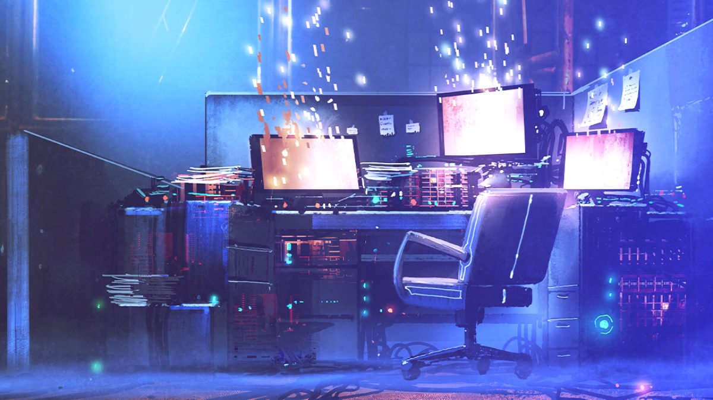
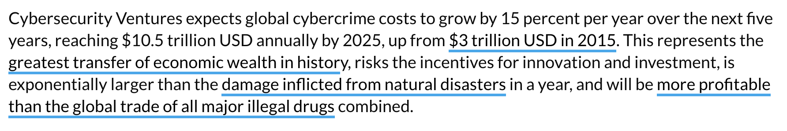

## THE CYBER PANDEMIC

Countries have a hard time defending themselves against cyber security threats; the main issue is that the technology available to them often comes from compromised sources. Where better to put backdoors than in the tools which should defend you? As such, we now have an IT infrastructure which is rife with issues and which is incredibly difficult to make secure.

EXISTING SOLUTIONS ARE TOO COMPLICATED AND OUTDATED.
A NEW APPROACH IS NEEDED.

Some more thoughts can be found in [https://threefoldfoundation.github.io/books/cyber_security_brief](https://threefoldfoundation.github.io/books/cyber_security_brief) 