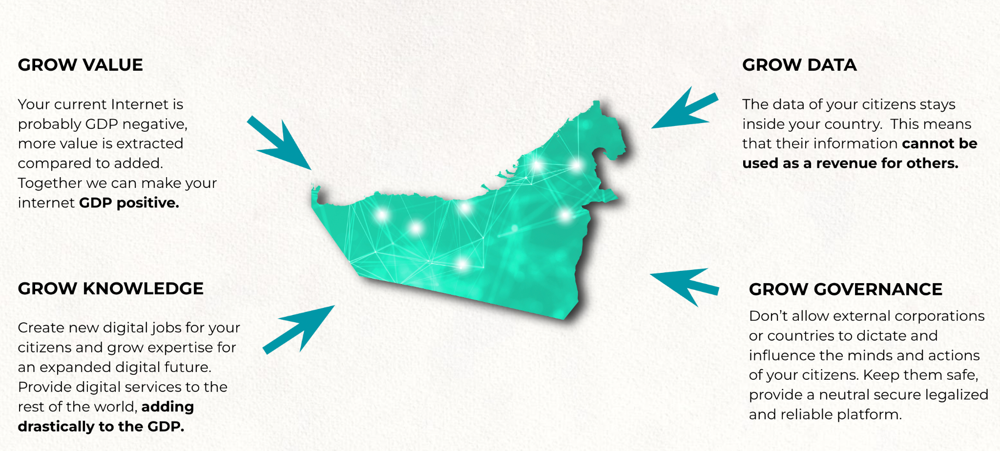

## SOVEREIGN COUNTRY INTERNET with many use cases inside

**Your Internet needs to be more GDP Positive**

There needs to be a decentralized but ultra sovereign digital backbone created which can deliver on following requirements. This is for all citizens in the country (unlike as described in the previous section).

* All data stays in country

* All users have a unique strongly authenticated identity (using novel mechanisms like proof of authenticity by means of peer review, which is much stronger compared to classic KYC/AML), this identity needs to be unique on country scale and usable for all digital services of the government as well as private sector if they would like to.

* All critical data is stored on a quantum safe storage system which means
    * Data can never be lost.
    * Data can never be corrupted.
    * The storage system used needs to self heal in case of disaster or corruption.
    * All history stays intact, data cannot be modified.
    * Encryption technology is NOT enough for security, because this is not quantum safe.
    * The system needs to be ultra scalable, support tens of millions of users and needs to be able to scale to at least 1000 petabyte to be ready for the future.
    * Reliability policy needs to be configurable, so the data provider/user can decide the level of protection (redundancy) required.
    * Even if the main datacenters go down, the data should stay intact & uncorrupted & online.
* Critical data means
    * All billing records.
    * Identity.
    * Utilization records.
    * Government information.
    * Government archives.
    * … to be further defined …
* The backbone needs to be scalable
    * At least 100m users need to be supported
* The backbone needs to be flexible, which means usable for all required digital services
* The backbone needs to be truly decentralized
    * Co-owned by the private sector as well as government institutions.
* The backbone needs to be truly sovereign
    * Delivered by local team operating in country (living & working)
    * Guided by a non corruptible entity (not for profit might be a good idea) as a supervising entity.
    * All source code is open (open source)
    * Enough technically skilled people in the country to work & understand this code.
    * The code is unlimited usable and there are no hidden costs (licenses, …) 
    * All improvements can be done from out of country

Internet & datacenter services need to contribute to the GDP of Country, today the Internet probably costs more money than it brings. By using a better digital system and new regulations Country can improve its revenue collection.

### More Decentralized And Fair Internet Connectivity Solution

We have our own 5G capable technology available which can be made part of the INCA project model, this allows thousands if not millions of users to co-own their own Telecom Infrastructure to give them access to their future digital life.

### Digital HealthCare + Digital Empowered Education System

Deliver solutions which cost less than what is available today and provide more inclusion, millions of people don’t have access to decent healthcare or education, this might improve that situation. Digital future Technology is very capable to make that happen. Super important that this technology stays in line with the above requirements.

### Digital Future Life

Allow everyone in the country to participate in a more GDP positive inclusive internet experience. There are a vast number of projects which fit underneath this category, but it's all about providing a sovereign digital future for every Country citizen.

### A Public Unified and Sovereign Country Digital Backbone

The upgraded sovereign internet digital backbone needs to be able to support:

* Digital countrywide identity.
* Central Bank Currency (OurLedgerC)
* Voting and other Government Services
* Government Collaboration system with way better security and data privacy measurements
* Education (deliver cost effective but capable education for everyone)
* Healthcare (medical records, global scalable healthcare for everyone)
* Mining Industry (more fair redistribution for natural country resources)
* Land Bank (register all land)
* Transparent Revenue Collection
* Port Authorities (avoid fraud)

### A government collaboration system

Without going into detail National Cyber Security is becoming a major topic of the future, see what happened with Ukraine, first this which happened was elimination of their core digital backbone and datacenters.

We believe the government needs to get a sovereign system where only opensource components are used which are understood by technical teams with deep level expertise on those components.

Some ideas

* Highly secure phones running non Google or Apple OS.
* Compute equipment in liquid cooled nodes, [EMP](https://www.govinfo.gov/content/pkg/CHRG-112hhrg80856/html/CHRG-112hhrg80856.htm) safe.
* Collaboration systems use fully decentralized but end2end encrypted infrastructure.
* Strong authentication.
* Entry points are in super safe but stateless environments, this means even if they get lost, data is never lost.
* Data storage is quantum safe
* Browsers CANNOT run Javascript in the browser on the computer (need to use a virtual browser in a secure vault environment).

This system can be integrated in the Sovereign Internet (also public), or as part of the more expensive but highly secure and reliable PRIVATE QUANTUM SAFE DIGITAL BACKBONE.