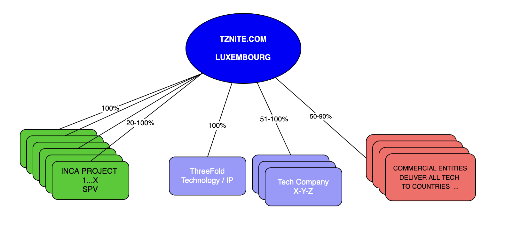

# TZNITE.COM (HIGHLY CONFIDENTIAL)

TZNITE.COM is a holding company in Luxembourg with has as purpose to deliver technology to the world which is capable to change the way how the internet works and can provide a regenerative secure sovereign Internet to countries as well as an Antidote for the Cyberpandemic which is real and represents a +10 Trillion USD treat.

We chose the name TZNITE which is a short name for Tanzanite which refers to a rare gemstone which can only be found in Tanzania very close to what people refer to as the "Cradle of the Humankind". Tanzanite is more rare than Diamond, it visualizes the unique values and possibilities we represent.

# TZNITE A PUBLIC DIGITAL CO-OWNED COMPANY 

TZNITE wants to organize a private/public STO (Security Token Offering) in 2023 for following purpose

* make the shares liquid to allow anyone to sell or buy their TZN Tokens (tokens representing shares)
* create a liquidity pool, to allow liquidity pool investors to supply liquidity as well as make margin on difference between buy & sale price in all transparency
* make the shares co-owned by thousands, so we all together own the TZNITE company which can bring real change to the world in relation to security (antidote cyber pandemic) as well as infrastructure layer for an upgraded more sovereign internet
* allow the fundraise for extra funds which allows further expansion of the ecosystem and technology stack

We expect the valuation to be higher than 1 Billion USD. This might even be much higher if we do some share swap strategies with other super valuable technology and go to market companies.

We will gradually raise 200m USD only if there is enough liquidity in the market, we expect the valuation to rise as commercial success happens. Every owner of our Security Token called TZN can use our liquidity pool concept to buy or sell TZN tokens providing return for liquidity pool investors as well.

Necessary Requirements:

* US Regulated A offering (costs 300k USD) = gives global protection
* Some highly credible public deals alive and kicking (e.g. Tanzania and is happening)
* Some high end partnerships which show & validate our valuation.
* A super strong CEO, CLO and CFO for TZNITE LUX
* Enough funding to kick it off

TZNITE is a holding company which embodies a lot of value and will grow that value of time substantially

* We use 20% of TZNITE shares to do share swaps, to build value & reach, each deal will re-establish our value and give us reach to markets & technology.

# TZNITE STRUCTURE

TZNITE holds 3 types of companies 

* Technology Companies : TZNITE owns 51-100% of these high valued technology startups. ThreeFold is the base company out of which this full structure was born.
* Commercial Delivery Vehicles: selling technology to governments, banks or large enterprises. Each Commercial Entity might have a specific use case or address a specific market and geographic region. 
* INCA SPV’s: each INCA project typically worth between 20-200m USD, an innovative token model is used to provide maximum economic value for everyone involved.. An INCA is a Sukuk compliant certificate.

