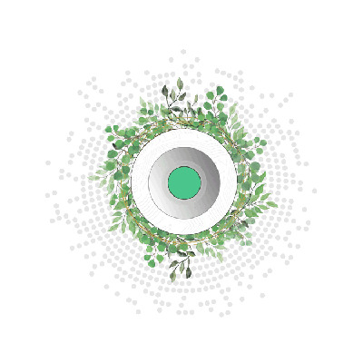

# DAO Consensus Engine

## DAO Engine

On TFGrid 3.0 ThreeFold has implemented a DAO consensus engine using Polkadot/TFChain blockchain technology.

This is a powerful blockchain construct which allows us to run our TFGrid and maintain consensus on global scale.

This system has been designed to be compatible with multiple blockchains.

