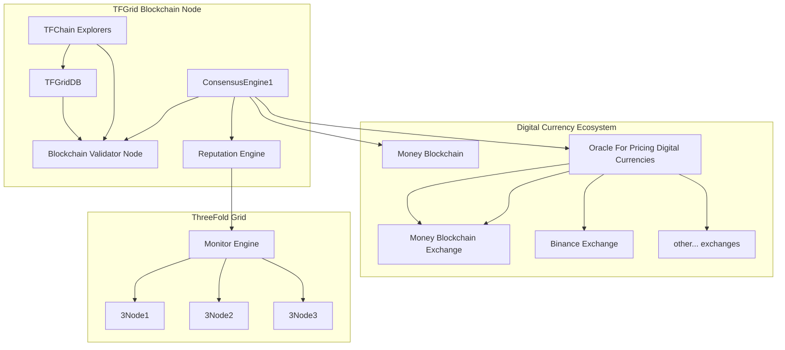

## Consensus 3.X Oracles used

Oracles are external resources of information.

The TFChain captures and holds that information so we get more certainty about the accuracy.

We have oracles for price & reputation for e.g. TFFarmers and 3Nodes.

These oracles are implemented on TF_CHAIN for TFGrid 3.0.

- See [Roadmap TFChain/DAO 3.x](roadmap_tfchain3) for info of implementation.

