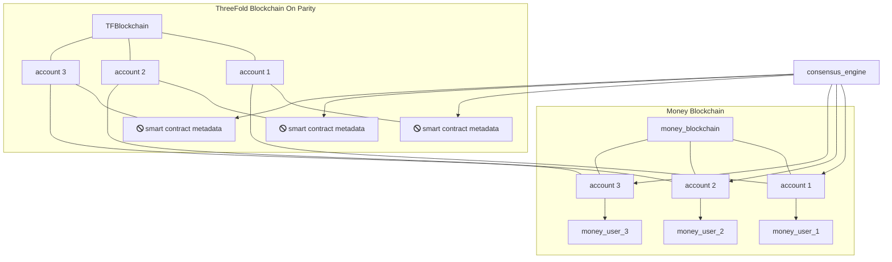

## Link between different Money Blockchain & TFChain

TF-Chain is the ThreeFold blockchain infrastructure, set up in the TFChain framework.

We are building a consensus layer which allows us to easily bridge between different money blockchains.

Main blockchain for TFT remains the Stellar network for now. A secure bridging mechanism exists, able to transfer TFT between the different blockchains. 
Active bridges as from TFGrid 3.0 release: 
- Stellar <> Binance Smart Chain
- Stellar <> Parity TFChain
More bridges are under development. 

Above diagram shows how our consensus engine can deal with TFChain and multiple Money Blockchains at same time.

