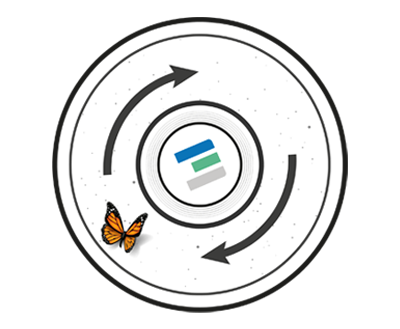

# Roadmap For our TFCHain and ThreeFold DAO

## TFChain / DAO 3.0.2

For this phase our TFChain and TFDAO has been implemented using parity/TFChain.

Features

- poc
- pou
- identity management
- consensus for upgrades of DAO and TFChain (code)
- capacity tracking (how much capacity used)
- uptime achieved
- capacity utization
- smart contract for IT
- validators for L1 (TFChain level)
- storage of value = TFT
- request/approval for adding a validator

Basically all basic DAO concepts are in place

## TFChain / DAO 3.0.x

TBD version nr, planned Q1 2022

NEW

- proposals for TFChain/DAO/TFGrid changes (request for change) = we call them TFCRP (ThreeFold Change Request Proposal)
- voting on proposals = we call them TFCRV (ThreeFold Change Request Vote)

## TFChain / DAO 3.1.x

TBD version nr, planned Q1 2022

This version adds more layers to our existing DAO and prepares for an even more scalable future.

NEW

- Cosmos based chain on L2
- Validator Nodes for TFGrid and TFChain.
- Cosmos based HUB = security for all TFChains

> More info about our DAO strategy see TFDAO.

