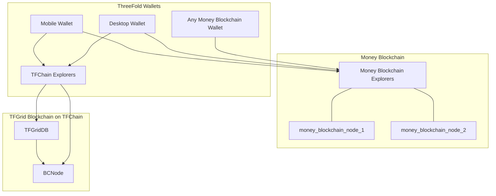
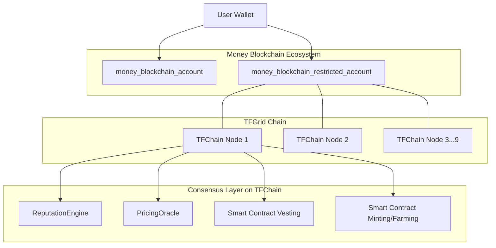

# TFGrid 3.0 Wallets

ThreeFold has a mobile wallet which will allow to be used on the TFChain backend (TFChain) as well as any other Money Blockchain it supports.

This provides for a very secure digital currency infrastructure with lots of advantages.

- [X] ultra flexible smart contracts possible 
- [X] super safe
- [X] compatible with multiple blockchains (money blockchains)
- [X] ultra scalable

Generic overview:

