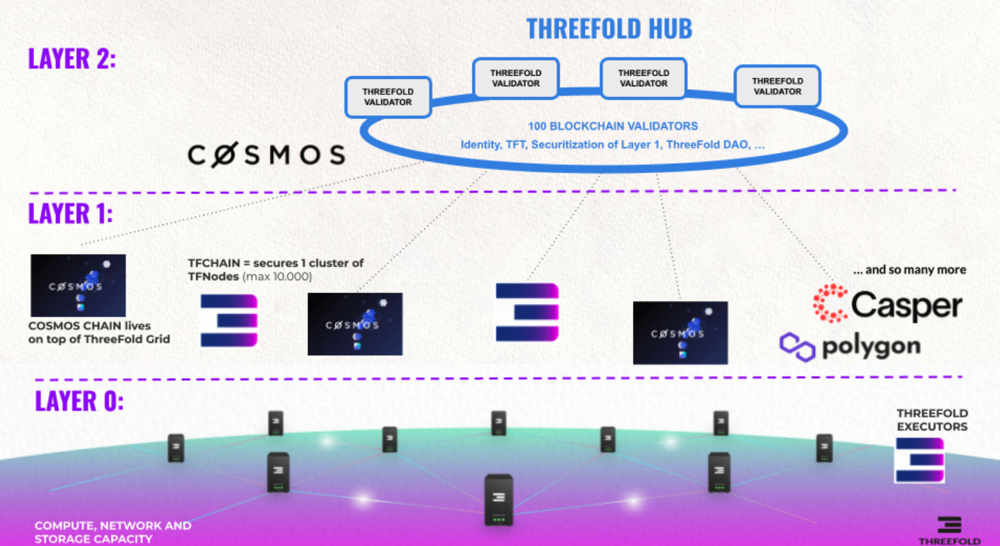

# DAO 3 Layer Approach

There are 3 layers in our ThreeFold GRID DAO

- Layer 2 = ecosystem security layer
  - only 1 blockchain with 100 validators, secures the multiple Layer 1 networks.
- Layer 1 = internet of blockchains layer
  - ultimate scale because of thousands or millions of blockchains
- Layer 0 = the IT capacity layer
  - cloud computing layer, provide compute, storage and network resources to L1 and L2

Validators play an important role in securing the ThreeFold ecosystem, a validator is a blockchain component run by independent parties who validate transactions happening on the blockchain until consensus has been achieved. 

