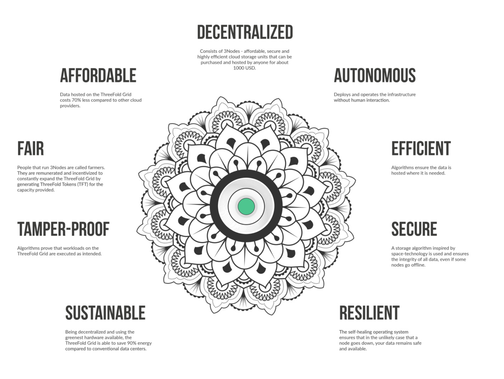

## Capacity Layer

 

### Zero-OS

ThreeFold has build its own operating system called, Zero-OS which was based starting from a Linux Kernel with as purpose to remove all the unnecessary complexity found on contemporary OS's. 

Zero-OS supports a small number of primitives, and performs low-level functions natively. 

It delivers 3 primitive functions: 
- storage capacity
- compute capacity 
- network capacity

There is no shell, local nor remote attached to Zero-OS. It does not allow for inbound network connections to happen to the core. Also, given its shell-less nature, the people and organizations, called farmers, that run 3nodes cannot issue any commands nor access its features. In that sense, Zero-OS enables a "zero people" (autonomous) Internet, meaning hackers cannot get in, while also eliminating human error from the paradigm. 

### 3Node

The ThreeFold_Grid needs hardware/servers to function. Servers of all shapes and sizes can be added to the grid by anyone, anywhere in the world. The production of Internet Capacity on the Threefold Grid is called Farming and people who add these servers to the grid are called Farmers. This is a fully decentralized process and they get rewarded by the means of TFT. 

Farmers download the Zero-OS operating system and boot their servers themselves. Once booted, these servers become 3Nodes. The 3Nodes will register themselves in a database called the TF_Explorer. Once registered in the TF_Explorer, the capacity of the 3Nodes will become available on the TF Grid Explorer. Also, given the autonomous nature of the ThreeFold_Grid, there is no need for any intermediaries between the user and 3Nodes. 

This enables a complete peer-to-peer environment for people to reserve their Internet Capacity directly from the hardware.

### Smart Contract for IT 

The purpose of the smart contract for IT is to create and enable autonomous IT. Autonomous self-driving IT is possible.

Once a smart contract for IT is created, it will be registered in the TFChain Blockchain.

Learn more about smart contract for IT [here](../smartcontract_it/smartcontract_tfgrid3.md).

### TFChain

A blockchain running on the TFGrid stores following information (TFGrid 3.0)

- registry for all digital twins (identity system, aka phonebook)
- registry for all farmers & 3nodes
- registry for our reputation system
- info as required for the Smart Contract for IT

This is the hart of our operational system of the TFGrid

### Peer-to-Peer Network

The peer-to-peer network allows any zmachine or user to connect with other zmachine or users on the TF Grid securely and creates a private shortest path peer-to-peer network. 

### Web Gateway

 The Web Gateway is a mechanism to connect the private (overlay) networks to the open Internet. By not providing an open and direct path in to the private network, a lot of malicious phishing and hacking attempts are stopped at the Web Gateway level for container applications. 