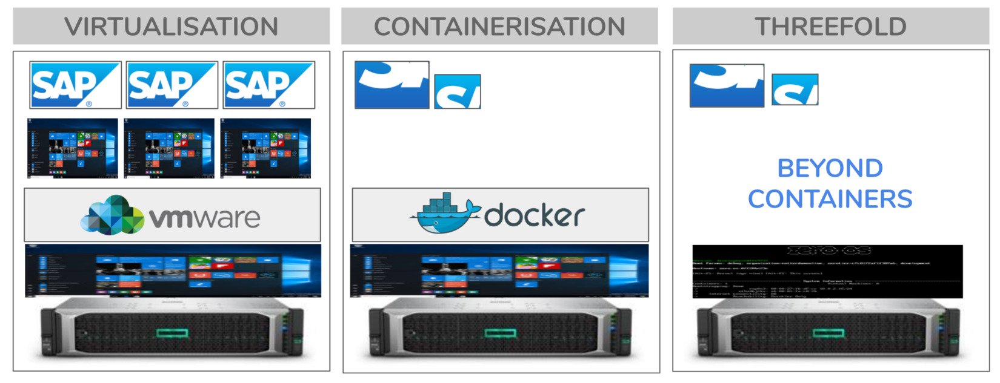

## Beyond Containers

Default features:

- compatible with Docker
- compatible with any Linux workload

We have following unique advantages:

- no need to work with images, we work with our unique zos_fs.
- every container runs in a dedicated virtual machine providing more security.
- the containers talk to each other over a private network: zos_net.
- the containers can use web_gw to allow users on the internet connect to the applications as running in their secure containers. 
- can use core-x to manage the workload.
