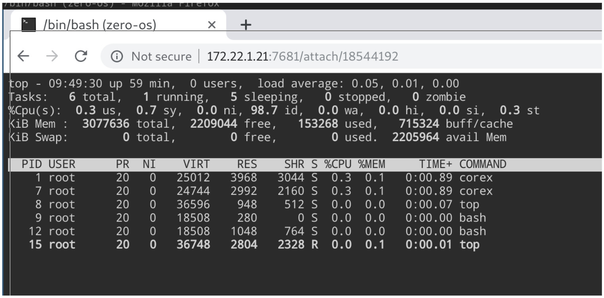

# CoreX

This tool allows you to manage your ZMachine over web remotely.

ZMachine process manager

- Provide a web interface and a REST API to control your processes
- Allow to watch the logs of your processes
- Or use it as a web terminal (access over https to your terminal)!

