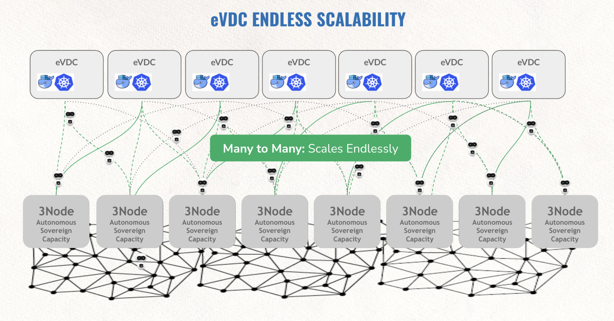
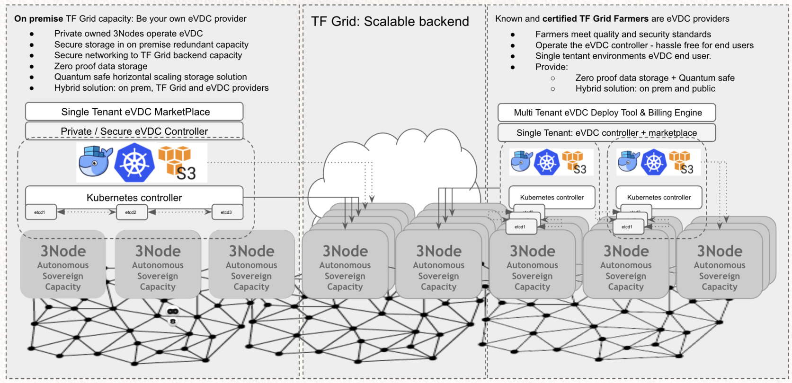

# ZKube

TFGrid is compatible with Kubernetes Technology.

Each eVDC as shown above is a full blown Kubernetes deployment.

### Unique for our Kubernetes implementation

- The Kubernetes networks are on top of our [ZNet](znet) technology which means all traffic between containers and kubernetes hosts is end2end encrypted independent of where your Kubernetes nodes are deployed.
- You can mount a QSFS underneath a Kubernetes Node (VM), which means that you can deploy containers on top of QSFS to host unlimited amounts of storage in a super safe way.
- You Kubernetes environment is for sure 100% decentralized, you define where you want to deploy your Kubernetes nodes and only you have access to the deployed workloads on the TFGrid.

### Features

*   integration with znet (efficient, secure encrypted network between the zmachines)
*   can be easily deployed at the edge
*   single-tenant!

<!-- 
### ZMachine Benefits

*   [ZOS Protect](zos_protect): no hacking surface to the Zero-Nodes, integrate silicon route of trust
*   [ZNet](znet) and [Planetary Net](planetary_network): a true global single backplane network connecting us all -->

### Architecture

