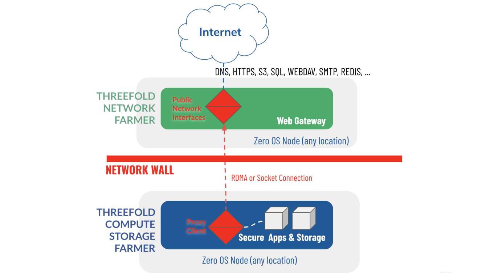
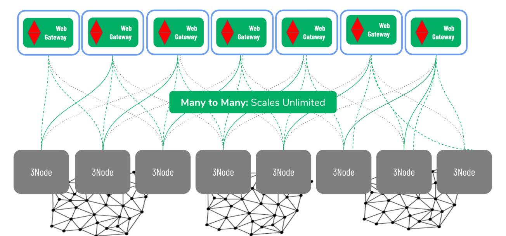

# WebGW

The Web Gateway is a mechanism to connect the private networks to the open Internet, in such a way that there is no direct connection between internet and the secure workloads running in the ZMachines.

- Separation between where compute workloads are and where services are exposed
- Redundant
    - Each app can be exposed on multiple webgateways at once
- Support for many interfaces...
- Helps resolve shortage of IPv4 addresses

### Implementation

Some 3nodes supports gateway functionality (configured by the farmers). A 3node with gateway configuration can then accept gateway workloads and then forward traffic to ZMachines that only have Planetary Network (planetary network) or Ipv6 addresses.

The gateway workloads consists of a name (prefix) that need to be reserved on the block chain first. Then the list of backend IPs. There are other flags that can be set to control automatic TLS (please check terraform documentations for the exact details of a reservation).

Once the 3node receives this workloads, the network configure proxy for this name and the Planetary Network IPs.

### Security

ZMachines have to have a Planetary Network IP or any other IPv6 (also IPv4 are accepted), it means that any person who is connected to the Planetary Network, can also reach the ZMachine without the need for a proxy.

So it's up to the ZMachine owner/maintainer to make sure it is secured and only have the required ports open.

### Redundant Network Connection

### Unlimited Scale

The network architecture is a pure scale-out network system, it can scale to unlimited size, there is simply no bottleneck. Network "supply" is created by network farmers, and network "demand" is done by TF Grid users. Supply and demand scale independently, for supply there can be unlimited network, farmers providing the web gateways on their own 3nodes, and unlimited compute farmers providing 3nodes for compute and storage. The demand side is driven by developers creating software that runs on the grid, system integrators creating solutions for enterprises. This demand side is exponentially growing for data processing and storage use cases.
