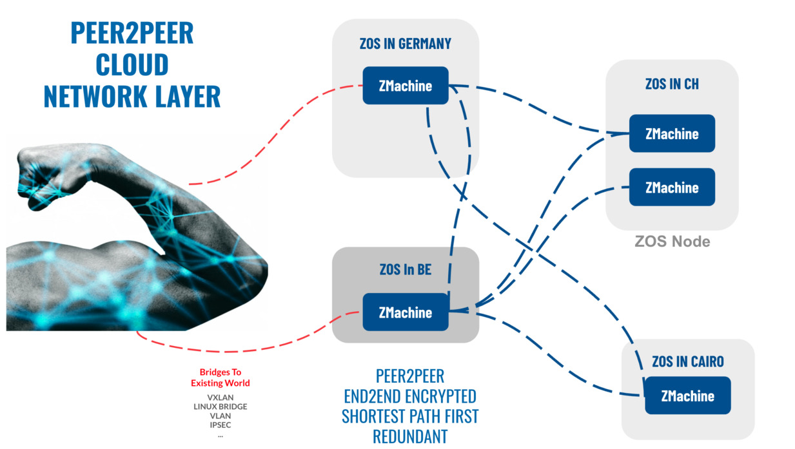
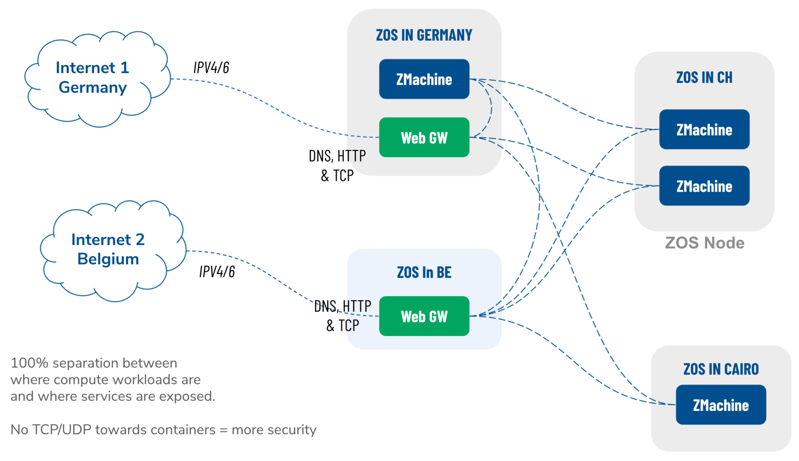

# ZNET

Decentralized networking platform allowing any compute and storage workload to be connected together on a private (overlay) network and exposed to the existing internet network. The Peer2Peer network platform allows any workload to be connected over secure encrypted networks which will look for the shortest path between the nodes.

### Secure mesh overlay network (peer2peer)

Z_NET is the foundation of any architecture running on the TF Grid. It can be seen as a virtual private datacenter and the network allows all of the *N* containers to connect to all of the *(N-1)* other containers. Any network connection is a secure network connection between your containers, it creates peer 2 peer network between containers. 

No connection is made with the internet. The ZNet is a single tenant network and by default not connected to the public internet. Everything stays private. For connecting to the public internet, a Web Gateway is included in the product to allows for public access if and when required.

### Redundancy

As integrated with [WebGW](webgw):

- Any app can get (securely) connected to the internet by any chosen IP address made available by ThreeFold network farmers through [WebGW](webgw)
- An app can be connected to multiple web gateways at once, the DNS round robin principle will provide load balancing and redundancy
- An easy clustering mechanism where web gateways and nodes can be lost and the public service will still be up and running
- Easy maintenance. When containers are moved or re-created, the same end user connection can be reused as that connection is terminated on the Web Gateway. The moved or newly created Web Gateway will recreate the socket to the Web Gateway and receive inbound traffic.

### Interfaces in Zero-OS

