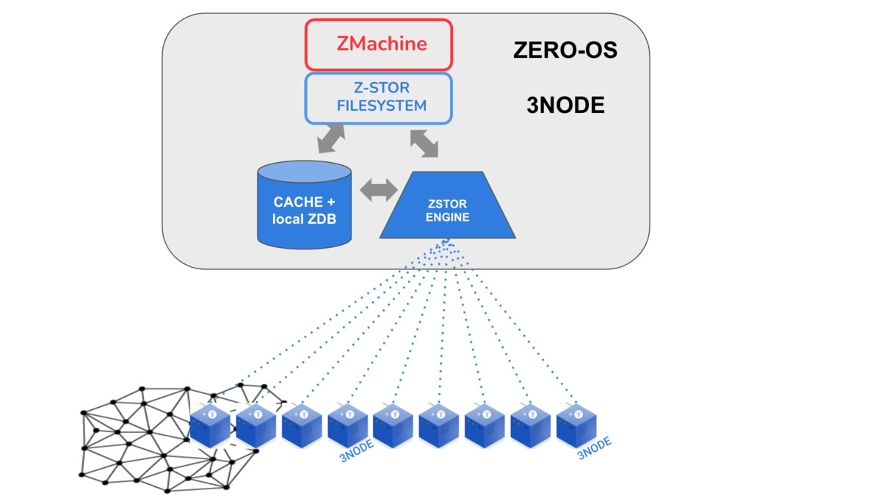

# Quantum Safe Filesystem

presents itself as a filesystem to the ZMachine.

### Benefits

- Safe
- Hacker Proof
- Ultra Reliable
- Low Overhead
- Ultra Scalable
- Self Healing = recovers service automatically in the event of outage with no human 

### Can be used as

- backup and archive system
- Blockchain Storage Backend (OEM ONLY)

### Implementation

see how its implemented in:

- [Quantum Safe Storage](../../qsss/qsss_home.md)
- [Quantum Safe Filesystem](../../qsss/qss_filesystem.md)
- [Quantum Safe Algo](../../qsss/qss_algorithm.md)

