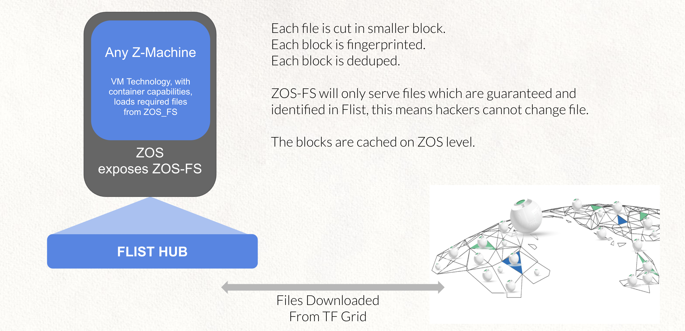
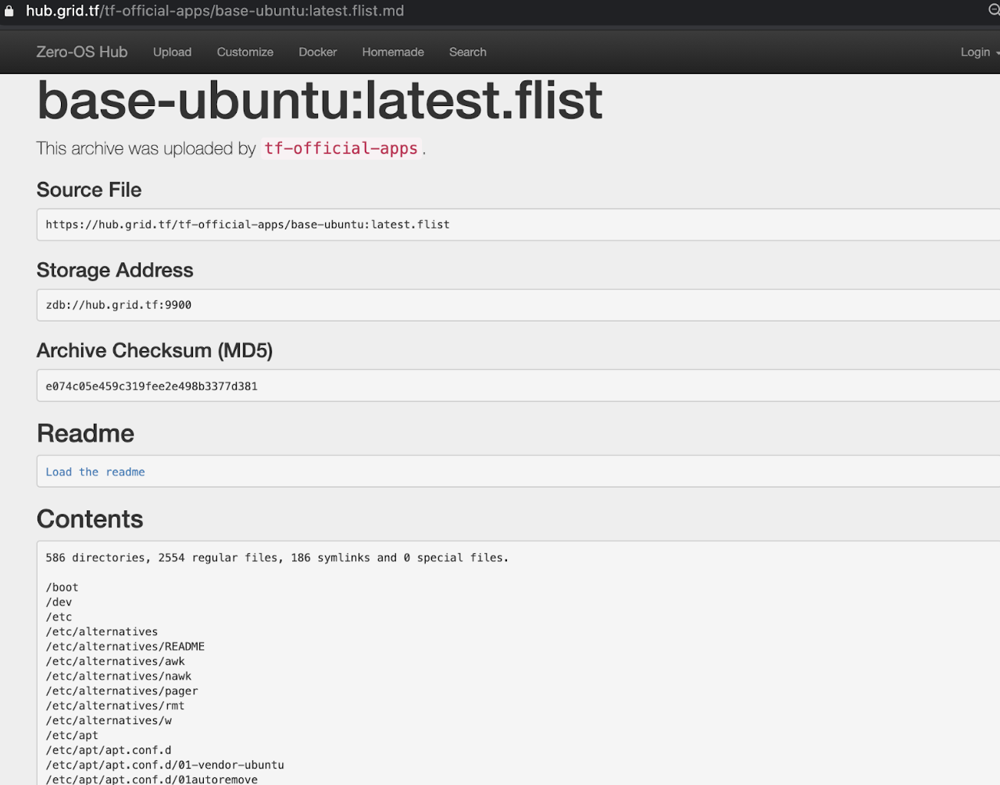

# ZOS FileSystem (ZOS-FS)

  

A deduped filesystem which is more efficient compared to images as used in other Virtual Machine technology.

## Uses FLIST Inside

In Zero-OS, `flist` is the format used to store zmachine images. This format is made to provide a complete mountable remote filesystem, but downloading only the files contents that you actually needs.

In practice, Flist itself is a small database which contains metadata about files and directories, file payload are stored on a tfgrid hub. You only need to download payload when you need it, this dramatically reduce zmachine boot time, bandwidth and disk overhead.

### Why this ZFlist Concept

Have you ever been in the following situation: you need two small files but they are embedded in a large archive.  How to get to those two files in an efficient way?  What a disappointment when you see this archive is 4 GB large and you only need four files of 2 MB inside. You'll need to download the full archive, store it somewhere to extract only what you need. Time, effort and bandwidth wasted.

You want to start a Docker container and the base image you want to use is 2 GB. What do you need to do before being able to use your container? Waiting to get the 2 GB downloaded. This problem exists everywhere but in Europe and the US where the bandwidth speeds are such that this doesn't present a real problem anymore, hence none of the leading (current) tech companies are looking for solutions.

We believe that there should be a smarter way of dealing with this than simply throwing larger bandwidth at the problem: what if you could only download the files you actually want and not the full blob (archive, image, whatever...).

ZFList is splitting metadata and data. Metadata is referential information about everything you need to know about content of the archive, but without the payload. Payload is the content of the referred files. The ZFList is exactly that: it consists of metadata with references that point to where to get the payload itself. So if you don't need it you won't get it.

As soon as you have the flist mounted, you can see the full directory tree, and walk around it. The files are only downloaded and presented at moment that you try to access them. In other words, every time you want to read a file, or modify it, Zero FS will download it, so that the data is available too. You only download on-the-fly what you need which reduces dramatically the bandwidth requirement.

## Benefits

- Efficient usage of bandwidth makes this service perform with and without (much) bandwidth.

## Flist Tool

  

> to see our tool for flists see: https://hub.grid.tf/

