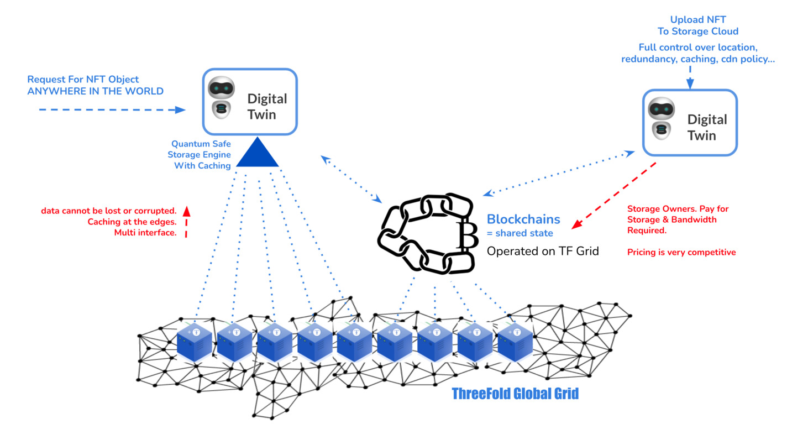
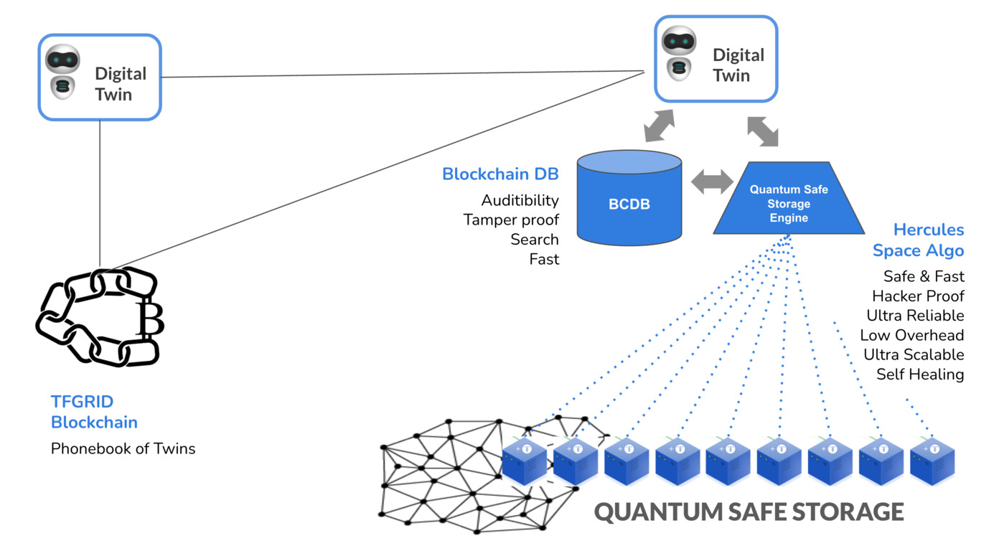
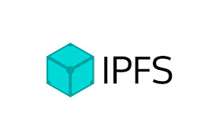
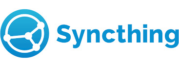

# Quantum Safe Storage System for NFT

The owner of the NFT can upload the data using one of our supported interfaces

- http upload (everything possible on https://nft.storage/ is also possible on our system)
- filesystem

Every person in the world can retrieve the NFT (if allowed) and the data will be verified when doing so. The data is available everywhere in the world using multiple interfaces again (IPFS, HTTP(S), ...). Caching happens on global level. No special software or account on threefold is needed to do this.

The NFT system uses a super reliable storage system underneath which is sustainable for the planet (green) and ultra secure and private. The NFT owner also owns the data.

## Benefits

#### Persistence = owned by the data user (as represented by digital twin)

Is not based on a shared-all architecture.

Whoever stores the data has full control over

- where data is stored (specific locations)
- redundancy policy used
- how long should the data be kept
- CDN policy (where should data be available and how long)

#### Reliability

- data cannot be corrupted
- data cannot be lost
- each time data is fetched back hash (fingerprint) is checked, if issues autorecovery happens
- all data is encrypted and compressed (unique per storage owner)
- data owner chooses the level of redundancy

#### Lookup

- multi URL & storage network support (see further the interfaces section)
- IPFS, HyperDrive URL schema
- unique DNS schema (with long key which is globally unique)

#### CDN support (with caching)

Each file (movie, image) stored is available on many places worldwide.

Each file gets a unique url pointing to the data which can be retrieved on all locations.

Caching happens on each endpoint.

#### Self Healing & Auto Correcting Storage Interface

Any corruption e.g. bitrot gets automatically detected and corrected.

In case of a HD crash or storage node crash the data will automatically be expanded again to fit the chosen redundancy policy.

#### Storage Algoritm = Uses Quantum Safe Storage System as base

Not even a quantum computer can hack data as stored on our QSSS.

The QSSS is a super innovative storage system which works on planetary scale and has many benefits compared to shared and/or replicated storage systems.

It uses forward looking error correcting codes inside.

#### Green

Storage uses upto 10x less energy compared to classic replicated system.

#### Multi Interface

The stored data is available over multiple interfaces at once.

| interface                  |                         |
| -------------------------- | ----------------------- |
| IPFS                       |        |
| http(s) on top of Digital Twin |        |
| syncthing                  |   |
| filesystem                 |  |

This allows ultimate flexibility from enduser perspective.

The object (video,image) can easily be embedded in any website or other representation which supports http.

