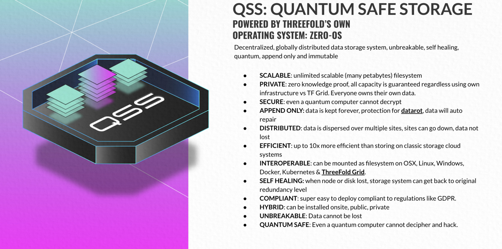

<!--  -->

i  

# Quantum Safe Storage System

Imagine a storage system with the following benefits

> This is not a dream but does exist and is the underpinning of the TFGrid.

Our storage architecture follows the true peer2peer design of the TF grid. Any participating node only stores small incomplete parts of objects (files, photos, movies, databases...) by offering a slice of the present (local) storage devices. Managing the storage and retrieval of all of these distributed fragments is done by a software that creates development or end-user interfaces for this storage algorithm. We call this '**dispersed storage**'.

Peer2peer provides the unique proposition of selecting storage providers that match your application and service of business criteria. For example, you might be looking to store data for your application in a certain geographic area (for governance and compliance) reasons. You might also want to use different "storage policies" for different types of data. Examples are live versus archived data. All of these uses cases are possible with this storage architecture, and could be built by using the same building blocks produced by farmers and consumed by developers or end-users.
