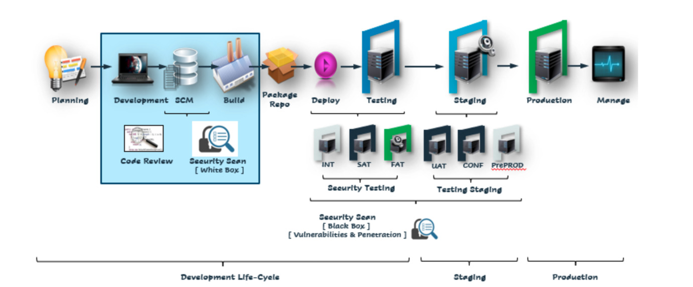
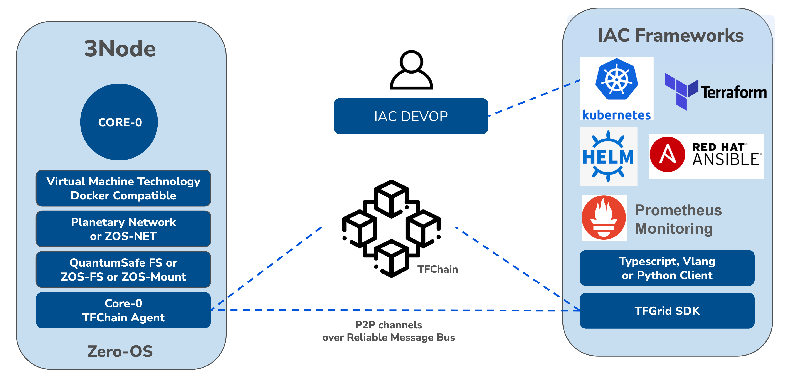

# Infrastructure As Code

IAC = DevOps is a process framework that ensures collaboration between Development and Operations Team to deploy code to production environment faster in a repeatable and automated way. ... In simple terms, DevOps can be defined as an alignment between development and IT operations with better communication and collaboration.

  

