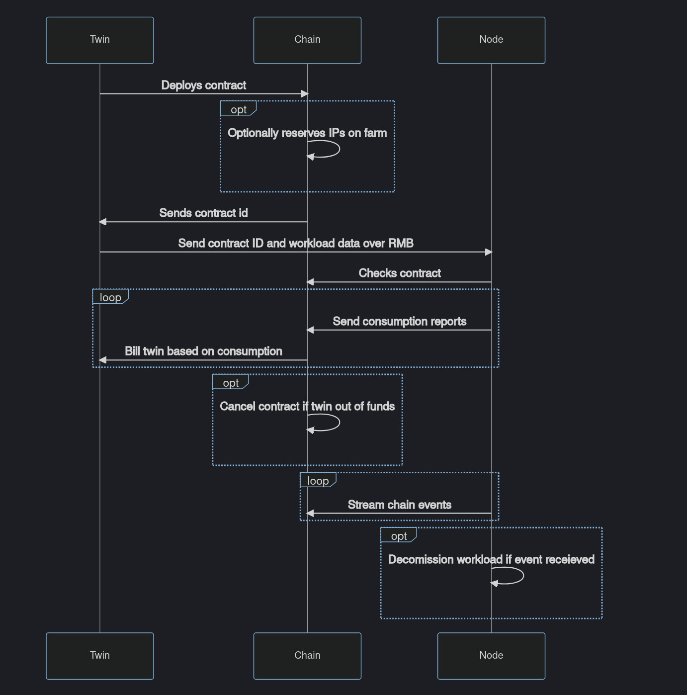

### Smart Contract IT Flow

The TFChain Blockchain will keep a record of all Entities, Twins, Nodes and Farmers in the TF-Grid network. This makes it easy to integrate the Smart Contract on TFChain as well since we can read from that storage in runtime.

The Smart Contract on TFChain works as following:
