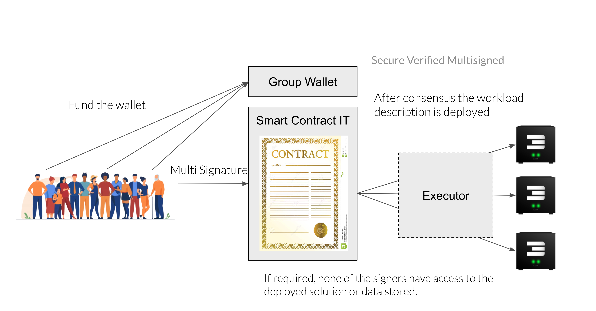

## Smart Contract for IT Intro

Ability for developers to launch IT workloads (applications) on the ThreeFold Grid using our TFGrid primitives secured by blockchain concepts.

  

Following benefits

- IT workloads can be deployed 100% deterministic, this means all specific properties of the workloads like necessary files, network bridges, processes, ... are all known at build time, this leads to good security and predictability.
- Consensus can be required for deploying a workload on the ThreeFold grid.
- Auditing and full transparancy on what has been deployed by who at what time.

