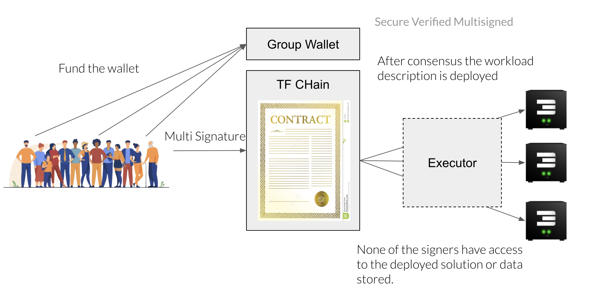

    
## Deterministic Deployment

  
    
The Dedupe filesystem flist uses an interface which allows you to create the file system interface in user space, it is a virtual filesystem. 

Metadata is exposed. The system sees the full tree of the image, but data itself is not there, data is downloaded whenever they are accessed and fully deduped (unique data).
     
>TODO: improve

### Benefits

  - Smart contract for IT
    The smart contract for IT concept is applicable to any workload: containers, VMs, all gateways primitives, volumes, kubernetes and network.
    It is a static agreement between farmer and user about deployment of an IT workload 
  - no dynamic behavior for deployment at runtime
  - no process can start unless the files are 100% described on flist level
    

### There are multiple ways to create an flist: 

   - Convert an existing docker image which is hosted on the docker hub
   - Push an archive like a tgz on the hub
   - A library and CLI tool exist to build the flist from scratch: doing it this way, the directory is locally populated, and the flist is then created from the CLI tool 
   - A [GitHub action](https://github.com/threefoldtech/publish-flist) allows to build a flist directly from GitHub action, useful for developers on GitHub 

