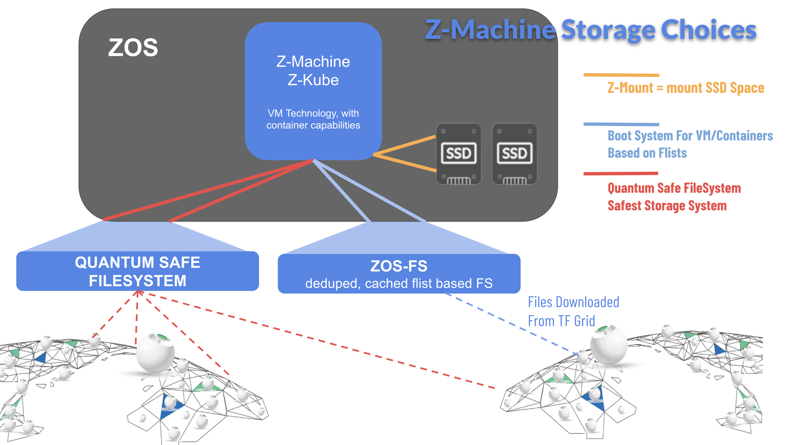

## Unbreakable Storage

  

- unlimited history
- survives network, datacenter or node breakdown
- no silent corruption possible
- quantum safe (data cannot be decrypted by quantum computers) as long as quantum computer has no access to the metadata
- self healing and autocorrecting

If you deploy a container with simple disk access, you don’t have it. 
Performance is around 50MB/second, if a bit more CPU is given for the distributed storage encoder, we achieve this performance. 
  
More info see [Quantum Safe Storage](../../qsss/qsss_home.md).

