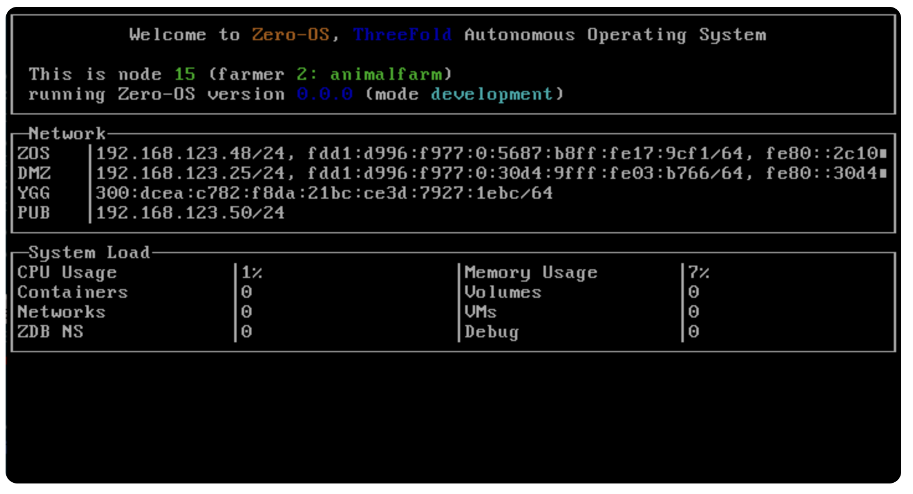

## Zero Boot

  

> Zero Boot = Zero-OS boot process

ZOS Boot is a boot facility that allows 3nodes to boot from network boot servers located in the TF Grid. This boot mechanism creates as little as possible operational and administration overhead. ZOS Boot is a crucial part for enabling autonomy by *not* having the operating system installed on local disks on 3nodes. With a boot network facility and no local operating system files you immediately erase a number of operational and administration tasks:

- to install the operating system to start with
- to keep track of which systems run which version of the operating system (especially in large setups, this is a complicated and error prone task)
- to keep track of patches and bug fixes that have been applied to systems

That's just the administration and operational part of maintaining a server estate with local installed operating system. On the security side of things the benefits are even greater:
- many hacking activities are geared towards adding to or changing parts of the operating system files. This is a threat from local physical access to servers as well as over the network. When there are no local operating system files installed this threat doesn't exist.
- accidental overwrite, delete or corruption of operating system files. Servers run many processes and many of these processes have administrative access to be able to do what they need to do. Accidental deletion or overwrites of crucial files on disk will make the server fail a reboot.
- access control. If there is no local operating system installed, access control, user rights, etc. are unnecessary functions and features, and don't have to be implemented.

### How?

In this image from fs, a small partition is mounted in memory to start booting the machine, it gets IPXE (downloads what it needs), and then 0-OS boots. 
After that, it is going to the hub, downloading different lists. 

There is one main flist that triggers downloads of multiple flists (see hub, and then https://hub.grid.tf/tf-zos/zos:development:latest.flist.md ). 
In there all the components/daemons that do part of the 0-OS. 
Also the download of the zos-bins, i.e. external binaries are triggered this way (https://hub.grid.tf/tf-zos-bins). 

The core components of zero-os can be found in: [Zero-OS repo](https://github.com/threefoldtech/zos/tree/master/bins/packages) = If something changes in the directory, a workflow is triggered to rebuild the full flist and push it to the hub. 
    
When a node discovers there is a new version of one of these lists on the hub, it downloads it and restarts the daemon with the new version. 
Over the lifetime of the node, it keeps pulling on the hub directories to check whether new daemons/flists/binaries are available and whether things need to be upgraded.

### Features

The features of ZOS Boot are:

- no local operating system installed
- network boot from the grid to get on the grid
- decreased administrative and operational work, allowing for autonomous operations
- increased security
- increased efficiency (deduplication, only one version of the OS stored for thousands of servers)
- all server storage space is available for enduser workloads (average operating system size around 10GB)
- bootloader is less than 1MB in size and can be presented to the servers as a PXE script, USB boot device, ISO boot image.

