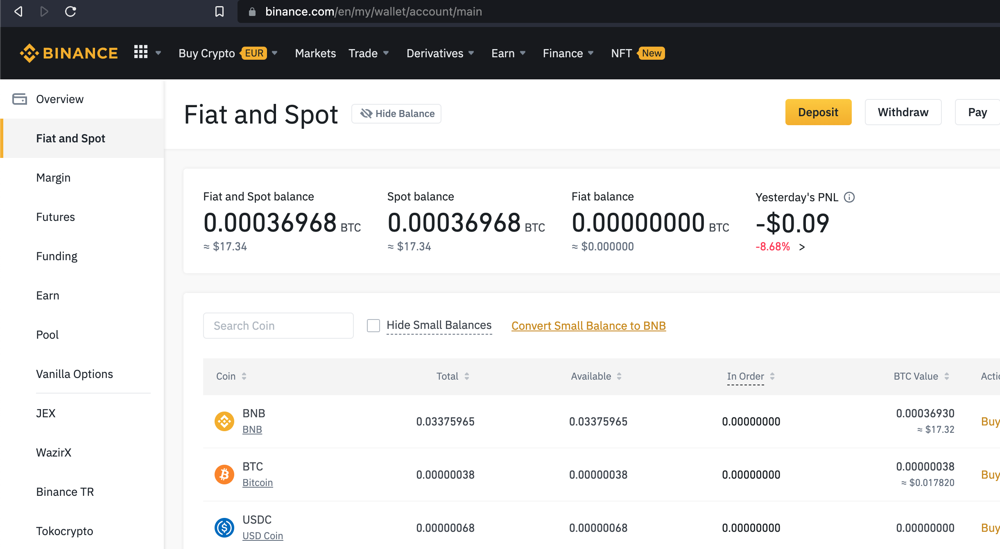
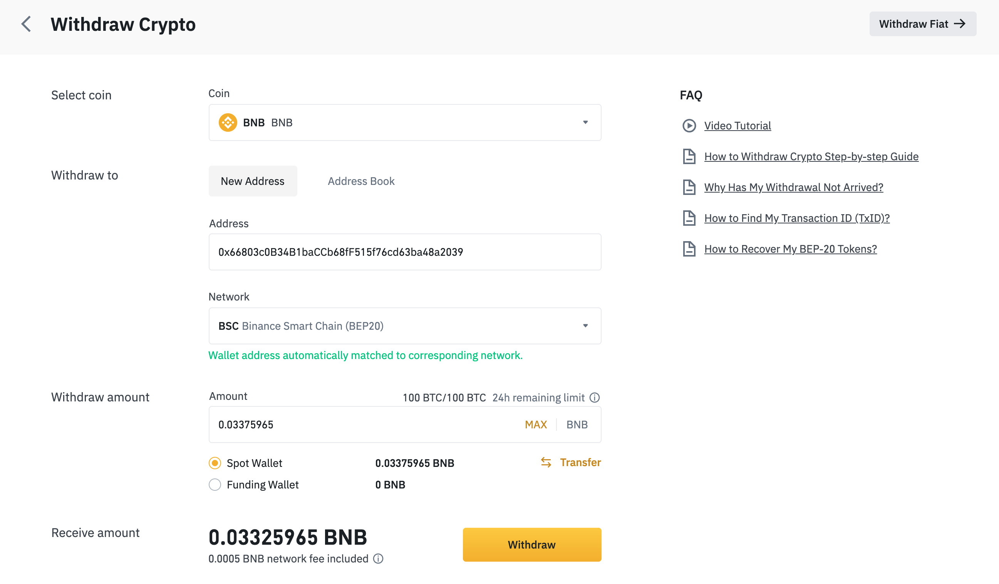

# Binance Get Started

- get Binance account (if you don't have one yet): https://accounts.binance.com/en/register 
- buy BNB: https://www.binance.com/en/buy-bnb, you can use a credit card for this or bank transfer.
    - BNB is the intermediate currency used to get to TFT
- you can also buy BUSD (which is USD on Binance), BUSD is a good pair to buy TFT on Binance Smartchain.

## Get a metamask Wallet

- [see here](tft_bsc_metamask)

## Get BNB in your Metamask Wallet

After login into Binance you should see something like:

Go to your account overview: https://www.binance.com/en/my/wallet/account/overview

- [Withdraw BNB](https://www.binance.com/en/my/wallet/account/main/withdrawal/crypto/BNB)

- Put the address of your metamask wallet

Here you can see how the BNB did arrive

From here things should be very easy, just click on one of following 2 links:

!!!include:pancakeswap_1inch

## More Info About Defi on Binance Smartchain

- see [tft_binance_defi](tft_binance_defi)