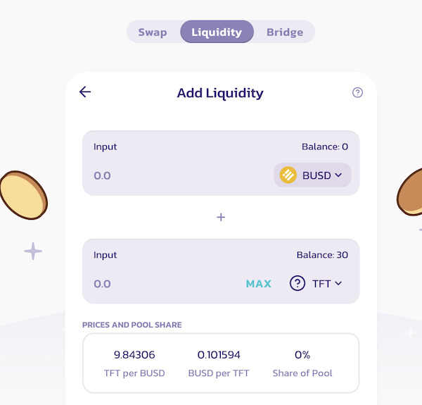
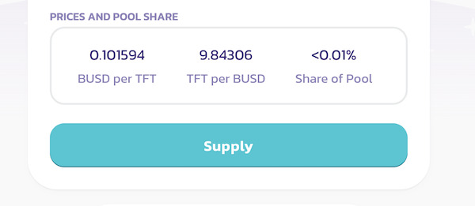
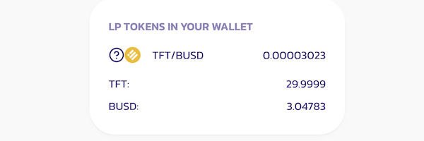

  

## How to become a Liquidity Provider in the TFT pools on PancakeSwap and earn Trading rewards.

1. You need to have a wallet configured for **Binance Smart Chain**, either via MetaMask (browser extension and mobile app) or on Trust Wallet (mobile only).
- Instructions to set up Metamask for BSC: [here](https://github.com/threefoldfoundation/info_threefold/blob/development_token/src/token/tft_bsc_bridge/tft_bsc_metamask)
- Instructions to set up Trust Wallet for BSC: [here](https://github.com/threefoldfoundation/info_threefold/blob/development_token/src/token/tft_bsc_bridge/tft_bsc_trustwallet)
2. You will need BNB in that wallet to cover transaction fees. Low amounts are sufficient, as the average transaction on BSC does not exceed 50ct USD.
3. Visit https://exchange.pancakeswap.finance/#/pool
> Please note it is very important to use the official contract address: **0x8f0fb159380176d324542b3a7933f0c2fd0c2bbf**. Do not use links or contract addresses from unverified sources. You may need to wait a few seconds for TFT to appear.
4. Choose any other currency to pair with TFT. We recommend BUSD for now, as that pool already has 380k in liquidity. Set the amount of liquidity that you want to provide for both currencies. For existing pools, the ratio between them is already fixed by the currencies and is already fixed by the market prices.

 

 

5. Click "approve" for both currencies, then confirm the wallet prompts and fees.

 

 

 

6. Click "supply" and confirm the wallet prompt and fee.

 

 

7. Wait for your LP tokens to show up.

 

 

8. You now exchanged the selected amounts for both currencies for LPs (Liquidity Tokens) and you are providing liquidity and earning a part of the transaction fees.

## Why provide Liquidity and become a ThreeFold LP 

Anyone interested in providing Liquidity to the ThreeFold pools on PancakeSwap will be incentivized and rewarded with trading fees. 0.17% of all trading fees of all transactions go to Liquidity providers. 

!!!include:token_toc